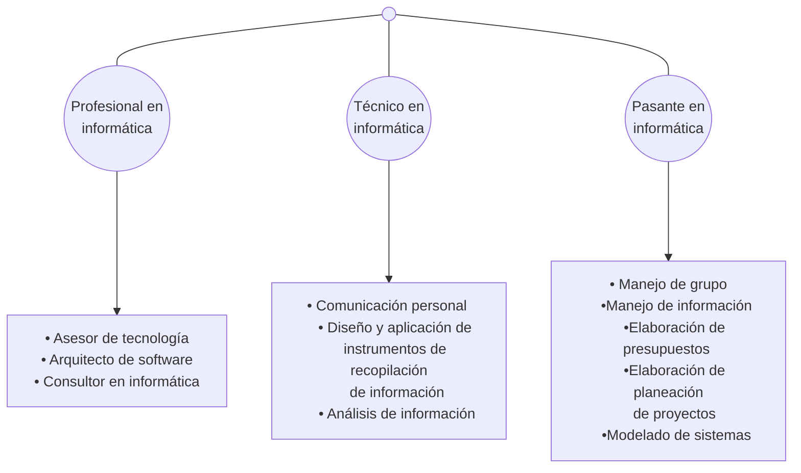

# Fundamentos de análisis de sistemas y desarrollo del software

**Información**: Conjunto de datos organizados, ya sean números, letras, imágenes, sonidos, etc., que dan el significado a algo.

Para dar significado a dicho conjunto de datos existen ciertos componentes:
- **Componente físicos:** Está formado por todos los aparatos electrónicos y mecánicos que realizan los cálculos y el manejo de la información.
- **Componente lógico:** Se trata de información que se ingresa de las aplicaciones, y que los componentes físicos trabajan para lograr emitir una salida, ya sea imagen, datos, etc.
- **Componente humano:** Está compuesto tanto por los usuarios que trabajan con los equipos como por aquellos que elaboran las aplicaciones.

Estos procesos se realizan mediados por un ordenador o PC, que esta compuesto por dos partes bien diferenciadas: **Hardware** y **Software**.

Una PC acepta datos a través de medios externos de entrada y que una vez ingresados debe procesarlos en forma automática, utilizando software o aplicaciones para luego mostrar ese resultado por algún medio de salida.

Es proceso es lo que conocemos como **sistema informático**, "Un conjunto  de elementos que hace posible el tratamiento automático de la información".

## Los sistemas y las tecnologías de la información en las empresas

### ¿Que es un sistema?

Un **sistema** es “un conjunto de elementos o componentes que interaccionan para alcanzar un objetivo. Los elementos por sí mismos y las relaciones entre ellos determinan cómo funciona el sistema”. [García, s.f.](https://bit.ly/3CH9JU2).

Un sistema de información es un conjunto de elementos o componentes interrelacionados que **recaban (entrada)**, **manipulan (proceso)**, **almacenan y distribuyen (salida)** datos e información y proporciona una reacción correctiva (mecanismo de retroalimentación) si no se ha logrado cumplir un objetivo. [García, s.f.](https://bit.ly/3CH9JU2).

**Los sistemas de información están compuestos por cuatro grandes procesos:**

- La **entrada** se define como “la actividad consistente en recolectar, captura o relevar la información con la que vamos a estar trabajando”
- **Procesamiento** es la transformación de datos en la muestra de la información que nosotros queremos visualizar. En este proceso se pueden realizar diferentes acciones “como cálculos, comparación de datos, toma de acciones alternas y almacenamiento de la información”
- La **salida** es el proceso que muestra los resultados de lo que se llevó a cabo en la etapa de procesamiento, que puede involucrar vista “por lo general en la forma de documentos, muestras por pantalla o reportes”
- La **retroalimentación** es el proceso por el cual se analizan las actividades mencionadas anteriormente y “se realizan los cambios para mejorar los procesos que fueron requeridos”

De estos conceptos previos derivan los **sistemas de información basados en computadoras** (**CBIS**, computer based information system), que es “el conjunto único de hardware, software, bases de datos, telecomunicaciones, personas y procedimientos configurado para recolectar, manipular, almacenar y procesar datos con el fin de convertirlos en información”. [García, s.f.](https://bit.ly/3CH9JU2).

- Es el proceso mediante el cual el sistema de información toma los datos que requiere para procesar.
- Es la capacidad del sistema de información para efectuar cálculos de acuerdo con una secuencia de operaciones preestablecida.
- El almacenamiento es una de las actividades o capacidades más importantes que tiene una computadora, ya que a través de esta propiedad el sistema puede recordar la información guardada en la sección o proceso anterior.
- La salida es la capacidad de un sistema de información para sacar la información procesada o bien datos de entrada al exterior.

### Teoría general de sistemas. Sistemas de información
“**La Teoría General de Sistemas** (**TGS**) fue concebida por **Ludwig von Bertalanffy** en la década de 1940 con el fin de proporcionar un marco teórico y práctico a las ciencias naturales y sociales” ([Román, 2011](https://bit.ly/36bJDfy).). Se basa en el análisis del estudio interdisciplinario de los sistemas en general, tomados de manera global, para estudiar cómo interactúan, cómo están constituidos, cómo se comunican entre sus propios elementos y con los de otros sistemas.

<!-- El **objetivo de la teoría de sistemas** es el descubrimiento sistemático de las dinámicas, restricciones y condiciones de un sistema, así como de principios (propósitos, medidas, métodos, herramientas, etc.) que puedan ser discernidos y aplicados a los sistemas en cualquier nivel de anidación y en cualquier campo, con el objetivo de lograr una equifinalidad optimizada. ([Teoría de sistemas, Wikipedia](https://es.wikipedia.org/wiki/Teor%C3%ADa_de_sistemas)) -->

Para aplicar los conceptos fundamentales de la teoría, se deben definir marcos de referencia, los cuales vamos a describir a continuación.
> ##### Primer Marco de referencia
> Consiste en construir un **modelo teórico** que represente a fenómenos generales que se encuentren en diferentes disciplinas. De hecho, busca en escénica reducir los sistemas concebibles a un numero manejable. Este primer marco de referencia presenta un objetivo de **baja ambición**, pero con **alto grado de confianza**, al descubrir similitudes en las construcciones teóricas de las diferentes disciplinas del saber y al desarrollar métodos teóricos aplicables por lo menos a dos áreas de estudio.

:::note
Un **modelo teórico** es una representación mental abstracta expresada mediante enunciados verbales, maquetas a escala física, dibujos, fórmulas matemáticas, analogías o de otros modos comunicativos. Estos modelos constituyen propuestas hipotéticas que buscan tanto “salvar los fenómenos” como facilitar predicciones empíricamente contrastables sobre los dominios empíricos con los que están relacionados
:::

> ##### Segundo Marco de referencia
> Consiste en ordenar jerárquicamente las disciplinas del saber en relación con la complejidad organizacional de sus componentes en un nivel de abstracción apropiado. presenta un objetivo de **alto grado de ambición** y **bajo de confianza**, al desarrollar un conjunto de teorías interactuantes o Sistema de Sistemas en áreas particulares del conocimiento humano, orientando la investigación a llenar vacíos existentes. (Hurtado Carmona, 2010, p. 4)

En la teoría general de sistemas existe lo que conocemos como la ***“información”***, y a esto lo llamamos **teoría de las informaciones**, que es la ciencia que se encarga de estudiar el manejo que se le da a la información, para poder contribuir en la organización y cumplimiento de los objetivos de cada uno de los sistemas con el que interactúa.

#### Características de los sistemas
Bertalanffy (1970) había definido que el sistema es un conjunto de procesos relacionados entre sí. De allí salen dos conceptos fundamentales que son el **propósito** y el **globalismo**.

- **Propósito u Objetivo.** Los elementos, como también las relaciones, establecen una distribución que trata
siempre de alcanzar un objetivo.
- **Globalismo o totalidad.** un cambio en uno de los procesos del sistema, con
probabilidad producirá cambios en los otros. [(Sesento García, 2008)](https://bit.ly/3vWk7pw).

#### Conceptos relacionados con el análisis del sistema

**Elementos**
    : Dentro de un sistema, son las partes o componentes que lo conforman. Estos pueden ser imágenes, textos, aplicaciones multimedia; si se logran identificar y organizarse, se llaman **modelos**.

**Atributos**
    : Son las características, estructuras y funciones de los elementos de un sistema.

**Modelos**
    : Son representaciones por medio de abstracciones o de gráficos, pero que enfocan ciertas partes importantes de un sistema. En informática es muy utilizado el lenguaje de modelado unificado (UML) utilizado para especificar, visualización, construcción y documentación de una estructura o proceso y su comportamiento

**Subsistema**
    : Es un conjunto de elementos interrelacionados que pertenecen a un sistema mayor

**Estructuras**
    : Hacen referencia a la articulación u organización, son parte del orden que se le da dentro de la aplicación, pueden ser referidas a la programación o al proceso, como también la base de datos.

### Características del análisis y diseño de sistemas
Las características del **análisis y diseño de sistemas** se refieren al proceso de examinar la situación o comportamiento de aplicaciones que hay dentro de una empresa con el propósito de mejorar con métodos y procedimientos más adecuados

Para ello, el desarrollo de sistemas tiene dos componentes.

| Análisis | Diseño |
| -------- | ------ |
| Es el proceso de e interpretación de hecho, diagnósticos de problemas y empleo de la información para recomendar mejoras al sistema. Es decir, especifica que es lo que el sistema de debe hacer. | Especifica las características del producto terminado. Es decir, establece como alcanzar el objetivo. |

#### Actividades del análisis de sistemas
Una de las primeras actividades es determinar las razones y el alcance que va a tener el análisis, buscar el motivo que está provocando la falla y por el cual nos convocaron.

Para lograrlo, las preguntas que deberías hacer son las siguientes.

¿Qué va a incluir el sistema? - ¿Qué información se necesita? - ¿Quién la necesita, cuándo, dónde, cómo o en qué forma? - ¿En dónde se origina, cómo puede obtenerse?

Ahora bien, una forma esencial para seguir buscando información, es continuar preguntando sobre: la actividad de la organización (“qué”) - las personas involucradas (“quién”) - de qué manera se desarrollan los procesos (“cómo”) - en qué momento (“cuándo”) - los gastos que involucra (“cuánto”) - el ambiente donde se lleva a cabo el trabajo (“dónde”).

#### Diseño del sistema
El diseño es el proceso creativo de transformación del problema en una
solución.
Para ello, se determinan que son procesos para determinar la magnitud del cambio que deseamos realizar, y es lo siguiente.

- **Diseño procedimientos:** se establecen la captura de datos, que son los diseños de entrada, para lo cual se grafican flujogramas o procesos.
- **Diseño de entrada:** cuáles van a ser los ingresos de esos datos, qué utilizará el usuario para ingresarlo (teclado, menú de pantalla, ratón, etc.).
- **Diseño de salidas:** aquí definimos cómo va a ser la muestra de la información, si va a ser impresión, salida por pantalla o salida por archivos, o procesos de comunicación con otros sistemas (webService).
- **Diseño de base de datos:** una vez definidos los métodos de entrada de la información, definimos la estructura que guarda la información y los cálculos que se realizan.
- **Diseño arquitectónico:** esta es la etapa en la que trabajamos la relación entre cada uno de los elementos estructurales del programa.
- **Diseño de la interfaz:** acá se define la comunicación del sistema con los otros componentes, con los usuarios; es la manera de vincular los procesos o procedimientos, para lo cual se grafican prototipos de pantallas.

En esta etapa el diseñador de sistemas debe tomar decisiones y, para ello, debe contar con las siguientes alternativas.

- Organizar el sistema en subsistemas.
- Identificar la concurrencia del problema.
- Asignar los subsistemas a los procesos y tareas que deben desarrollar.
- Conocer el acceso a recursos, perfiles y roles.
- Pensar la manera en cómo se va a realizar la implementación de control en software.
- Manejar las condiciones con los usuarios, que estén preparados para el cambio.

### El rol del analista de sistemas

El **analista de sistemas** es un perfil que interactúa entre los usuarios y la tecnología o las aplicaciones. Debe ser capaz de desempeñarse en diferentes roles, muchas veces en simultáneo, por lo que debe conocer los procesos de entrada/salida de los datos y la producción de información, para poder ayudar ante alguna eventualidad, diseñar procesos o gestionar mejoras en los procesos de la organización en la que se desempeña.

En este sentido, el analista de sistemas, dentro de una organización, puede actuar como:

1. **ANÁLISIS DE SISTEMAS** (analista de información): es reunir información y determinar los requisitos. Los analistas no son responsables del diseño de sistema. 
2. **ANÁLISIS Y DISEÑO DEL SISTEMA** (diseñadores de sistemas, diseñadores de aplicaciones): el analista tiene la responsabilidad adicional de diseñar el nuevo sistema.
3. **ANÁLISIS, DISEÑO Y PROGRAMACIÓN DEL SISTEMA** (analista programador): desarrolla las especificaciones de diseño y escribe el software necesario para implementar el diseño.

#### Cualidades y habilidades que el analista debe tener

- Una analista debe solucionar problemas y debe hacer frente a problemas complejos de forma cotidiana.
- Competencias como el conocimiento técnico, experiencia y comunicación.
- Evolución permanente.

<!--  -->

#### Un perfil adecuado y algunas características

## Gestión de proyecto del desarrollo de software

Un proyecto busca crear un producto, servicio o resultado. Esto se denomina **entregable**, y puede ser un artículo producido, un elemento terminado o un componente. Lo importante es que el **entregable** siempre debe ser un elemento **cuantificable**. La capacidad de prestar un servicio o un resultado como, por ejemplo, un documento o un proyecto de investigación, también puede ser considerado un **entregable** en tanto se pueda cuantificar.

Por otro lado, esta definición también habla de que un proyecto es esfuerzo temporal y único, esto significa que el proyecto debe tener un comienzo y un final definidos, característica que lo diferencia de otro tipo de trabajos que pueden existir en las organizaciones como lo son las operaciones, que son acciones más rutinarias, continuas y repetitivas, que se relacionan más bien con el mantenimiento diario.

Ahora bien, sí podemos determinar que ambos conceptos tienen en común el hecho de ser realizados por personas; están restringidos por la limitación de recursos y pueden ser planeados, ejecutados y controlados. Estas personas que velan por el cumplimiento de los pasos o tareas para el desarrollo de tal proyecto, son el equipo de proyectos.

Para llevarlo a cabo el proyecto, existen diferentes metodologías de ejecución. Es decir, diferentes procedimientos racionales, técnicas concretas, habilidades y conocimientos específicos
que ayudarán a alcanzar ese objetivo deseado.

### Fundamentos de proyectos software
Un **proyecto de software** es una tarea bien definida, en un momento concreto en el tiempo, durante el que se realizan una cantidad de pasos, procesos o combinatoria de operaciones desde la recogida de **requisitos**, pasando por las **pruebas** y el **mantenimiento**, con el único objetivo de lograr un producto o aplicación determinado.

Todos los proyectos de desarrollo de software juegan con las limitaciones del entorno, por lo que traen con ellos riesgos determinados y por eso es esencial gestionarlos de manera eficiente. Existen tres limitaciones principales para estos proyectos: **tiempo**, **costo** y **calidad**.

Como se muestra en la imagen, una parte importante del proyecto consiste en “entregar un producto de calidad, manteniendo el costo dentro de las limitaciones del presupuesto del cliente, en el menor tiempo posible”  [(Tutoriales Point, s.f.)](https://bit.ly/3w2KVV5)

### Gestión de alcance y estimación de un proyecto software

#### El alcance del proyecto
Cuando hablamos de definir el alcance, nos referimos a conocer todas las actividades y procesos que se deben tener en cuenta, para crear el entregable que requiere el proyecto.

Esta etapa es esencial, porque en ella se crean las condiciones de lo que se va a realizar y lo que no. Esto permite dividir el proyecto en tareas, determinar el tiempo que puede tomar cada una y cuantificar o medir todo el proceso. Para esto es requisito que el equipo de proyectos pueda:

- Conocer los requerimientos o necesidades del cliente.
- Tener objetivos establecidos y posibles de realizar.
- Equilibrar las solicitudes permanentes de calidad, alcance, tiempo y costos.
- Adaptar el alcance, los planes y objetivos a las inquietudes y expectativas de los interesados/clientes.

Durante la gestión del proyecto es necesario poder determinar puntos de control que permitan saber dónde controlar cada etapa del proyecto. Estos puntos de control son:

- Definir el alcance
- Decidir su verificación y control
- Dividir el proyecto en pequeñas partes para facilitar su gestión
- Verificar el alcance
- Controlar el alcance incorporando cambios a este

#### Estimaciones del proyecto
Para estimar se suelen utilizar varios métodos.

**Estimación del tamaño del software:** este método se lo conoce con el nombre **KLOC** (kilo línea de código), o calculando el número de puntos de función en el software.

**Estimación del esfuerzo:** este método es muy utilizado actualmente y toma tres parámetros importantes para poder trabajar y calcular el esfuerzo. Ellos son:

  - Lo que pueden aportar, desde la experiencia misma, los participantes de proyecto;
  - Los datos históricos o las experiencias de esfuerzo de otros proyectos;
  - Alguna formulación estándar de cálculo.

**Estimación del tiempo:** es un complemento a las estimaciones presentadas anteriormente. En esta, los requerimientos se dividen por categorías según los requisitos y las relaciones que pueda
obtenerse entre los componentes del software. Esto se llama **descomposición del trabajo** y se temporizan de acuerdo con el calendario, definido por día, semana o mes. La sumatoria total, de acuerdo con el cálculo realizado, es el tiempo total que durará el proyecto.

**Estimación del coste:** esta estimación también se obtiene de los resultados que definimos en las estimaciones anteriores, porque depende de los elementos o procesos mencionados anteriormente. Para estimar el costo del proyecto se requiere tener en cuenta lo siguiente:

- El tamaño del software.
- El hardware.
- Herramientas o software adicional, licencias, etc.
- Recursos humanos formados para tareas concretas.
- Consideraciones de viaje, movilidad.
- Soporte

#### Técnicas de estimación

**Técnica de descomposición:** Hay dos modelos fundamentales
  - **Línea de código.** La estimación se realiza en representación al número de líneas de códigos en el producto software.
  - **Puntos de función.** La estimación se realiza en representación al número de puntos de función que hay en el producto software.

**Técnica de estimación empírica:** Son derivadas estas estimaciones, de fórmulas que se basan en LOC (línea de control) o FPs (lenguajes de programación).

**Modelo Putnam:** […] El modelo Putnam dibuja el mapa de esfuerzos y tiempo que se requiere para el tamaño del software.

**COCOMO:** significa 'COnstructive COst MOdel' (modelo de coste constructivo), desarrollado por **Barry W. Boehm**. Divide el producto software en 3 categorías de software: **orgánica**, **semi-independiente** e **incrustado**.

### Gestión de riesgos de un proyecto de software
En todo proyecto existen riesgos que pueden ser predecibles o no. En general, los riesgos pueden originarse desde diferentes áreas.

- **De la gestión de los recursos tangibles:** siempre debemos partir de la base de que la mayoría de los recursos que tenemos están disponibles en cantidades limitadas, y la falta de recursos de alguno de ellos siempre obstaculiza cualquier desarrollo y puede traer demoras en toda la planificación realizada. Por ello, es esencial tener contemplada la posibilidad de poder distribuir recursos adicionales si es necesario, aun sabiendo que esto puede aumentar el costo y el presupuesto del cliente.
- **De la gestión de los recursos humanos:** ya que siempre habrá integrantes más o menos capacitados, que tengan experiencia o no. Para evitar conflictos se hace necesario estimar y distribuir los recursos adecuados para cada etapa del proyecto. Algunas pautas que debemos considerar en todo proyecto son:
  1. identificar los recursos y las actividades para poder asignar las tareas y distribuir las responsabilidades a cada miembro del equipo de desarrollo;
  2. determinar el expertise de los recursos requeridos para cada fase concreta y su disponibilidad.
- **Estimación errada en las actividades del proyecto, ya sea por actividades no visualizadas, como mal determinado el tiempo:** será importante aquí gestionar recursos humanos y a los integrantes del equipo, incluyéndolos en el proyecto cuando sean necesarios y retirándolos cuando ya no lo son.
- **Problemas de comunicación:** un mal manejo de la comunicación puede crear vacíos en las conexiones entre el cliente y la organización, entre los miembros del equipo, así como con los proveedores de hardware, etc.
- **Cambios tecnológicos de la organización que no fueron previstos:** siempre pueden existir cambios o pedidos requeridos que sean malinterpretados o que surgieron de improviso y sobre los que deberemos trabajar sobre la marcha

Para poder disminuir los riegos al mínimo posible, es fundamental una adecuada gestión y organización:
- **Planificación:** este paso incluye la identificación de los accionistas, y la forma en que se van a comunicar entre ellos.
- **Compartir:** después de determinar varios aspectos de la planificación, el director se centra en compartir información correcta con la persona correcta y en el momento correcto en el tiempo. Esto mantiene a todos los miembros del proyecto al día del progreso y del estatus del proceso.
- **Retroalimentación:** los jefes del proyecto usan varias medidas y mecanismos de retroalimentación y crean informes de estatus y de acción. Este mecanismo asegura que la entrada de varios accionistas llegue al jefe del proyecto como su retroalimentación.
- **Cierre:** al final de cada evento […] se anuncia el cierre administrativo para actualizar a cada accionista vía email, o distribuyendo una copia por escrito del documento o a través de otro medio de comunicación efectivo.

Además, para poder trabajar el proceso de la gestión del riesgo de manera adecuada, podemos realizar varias actividades:
- Identificación
- Categorizar
- Gestionar
- Monitorear

### Introducción a proyectos con metodologías ágiles

La **metodología ágil** nace en contraposición a la metodología denominada “tradicional” o de **modelo en cascada**.

Mientras que las metodologías tradicionales se centran especialmente en el control del proceso, a través de “una rigurosa definición de roles, actividades, artefactos, herramientas y notaciones para el modelado y documentación detallada” ([Maida y Pacienzia, 2015](https://bit.ly/3tQvOva)), los enfoques ágiles centran las tareas y el trabajo en función de las necesidades finales del cliente o de las expectativas del usuario, involucrándolo en cada etapa del proceso de desarrollo.

Con el fin de asegurar la mejora continua de los servicios sin perder la rigurosidad ni los formalismos implícitos en las buenas prácticas de trabajo, sus adscriptos elaboraron un **“manifiesto ágil”**, en el que determinaron los siguientes 4 principios fundamentales.

1. **INDIVIDUOS E INTERACCIONES POR ENCIMA DE PROCESOS Y HERRAMIENTAS**
   1. Se promueve la cooperación en el equipo.
   2. Se lo incorpora al usuario final en el equipo
   3. Se valora mas a un buen entorno de trabajo que a las herramientas de trabajo
2. **SOFTWARE FUNCIONAL POR ENCIMA DE DOCUMENTACIÓN EXTENSIVA**
   1. trata de sacrificar el tiempo invertido en documentación innecesaria e implementarlo en el desarrollo como tal.
   2. Los documentos deben ser escasos, breves, funcionales e inteligibles para todo el equipo.
3. **COLABORACIÓN CON EL CLIENTE POR ENCIMA DE LA NEGOCIACIÓN CONTRACTUAL**
   1. Es importante que exista complicidad entre el cliente y el equipo de desarrollo
4. **RESPUESTA ANTE EL CAMBIO ANTES DE SEGUIR UN PLAN**
   1. Los proyectos deben adaptarse a los cambios que la propia organización sufre.
   2. Planear pero no de forma hermética y estricta. Debe ser abierta y flexible para que adaptar el proyecto a los cambios sea posible y sencillo

#### Principios ágiles
1. Hacer entregas continuas de software para aportar valor al cliente.
2. Aceptar los cambios incluso al final del desarrollo para conseguir ventajas competitivas.
3. Entregar un software funcional, entre cada dos semanas y dos meses, cuanto antes.
4. Los responsables del negocio y los desarrolladores deben trabajar juntos día a día.
5. Garantizar que el entorno de trabajo está adaptado a los desarrolladores para mantener motivado al equipo.
6. El diálogo cara a cara es fundamental para garantizar la comunicación en el equipo de desarrollo.
7. El software funcional marcará el progreso del proyecto.
8. El ritmo de trabajo debe ser constante y el desarrollo, sostenido.
9. La atención continua al diseño y a la calidad técnica mejoran la agilidad.
10. La simplicidad en los procesos de desarrollo es esencial.
11. Los mejores diseños y arquitecturas nacen de los equipos que se organizan 