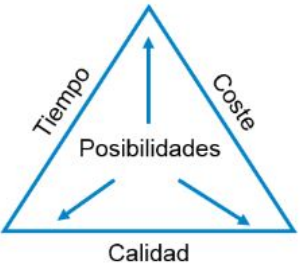

# Resumen de Fundamentos de análisis de sistemas y desarrollo del software

## Unidad 1. Los sistemas y las tecnologías de la información en las empresas

Partiendo del concepto de "Sistema", se define **sistema de información** como un conjunto de elementos o componentes interrelacionados que **recaban (entrada)**, **manipulan (proceso)**, **almacenan y distribuyen (salida)** datos e información y proporciona una reacción correctiva si no se ha logrado cumplir un objetivo (**Retroalimentación**). Donde la **Información** es el Conjunto de datos organizados, ya sean números, letras, imágenes, sonidos, etc., que dan el significado a algo.

Para dar significado a dicho conjunto de datos existen ciertos componentes:
- **Componente físicos:** Está formado por todos los aparatos electrónicos y mecánicos que realizan los cálculos y el manejo de la información.
- **Componente lógico:** Se trata de información que se ingresa de las aplicaciones, y que los componentes físicos trabajan para lograr emitir una salida, ya sea imagen, datos, etc.
- **Componente humano:** Está compuesto tanto por los usuarios que trabajan con los equipos como por aquellos que elaboran las aplicaciones.

Posteriormente, se hace hincapié sobre los **sistemas de información basados en computadoras** (**CBIS**, computer based information system) como el conjunto de único de hardware, software, bases de datos, telecomunicaciones, personas y procedimientos configurado para recolectar, manipular, almacenar y procesar datos con el fin de convertirlos en información.

En estos sistemas se pueden identificar 4 procesos.

- **Entrada:** Es el proceso mediante el cual el sistema de información toma los datos que requiere para procesar.
- **Procesamiento:** Es la capacidad del sistema de información para efectuar cálculos de acuerdo con una secuencia de operaciones preestablecida.
- **Almacenamiento:** Es una de las actividades o capacidades más importantes que tiene una computadora, ya que a través de esta propiedad el sistema puede recordar la información guardada en la sección o proceso anterior.
- **Salida:** Es la capacidad de un sistema de información para sacar la información procesada o bien datos de entrada al exterior.

### Tema 2. Teoría general de sistemas. Sistemas de información
La Teoría General de Sistemas (TGS) fue concebida por Ludwig Von Bertalanffy y se utiliza para estudiar cómo interactúan, cómo se constituyen y como se comunican los elementos dentro de un sistema o con los elementos de otro. La metodología consiste en el análisis del estudio interdisciplinario de los sistemas en general, tomados de una manera global.

Bertalanffy define un sistema como un conjunto de procesos relacionados entre sí, destacando dos conceptos fundamentales: el **propósito u objetivo**, que guía la distribución de elementos y relaciones hacia una meta, y el **globalismo o totalidad**, que indica que un cambio en un proceso puede afectar a otros.

Para aplicar los conceptos fundamentales de la teoría, se deben definir marcos de referencia. El primer marco, de **baja ambición y de alto grado de confianza**, consiste en construir modelos teóricos que representen fenómenos generales de diversas disciplinas, con el objetivo de reducir la complejidad de los sistemas concebibles y desarrollar métodos aplicables a múltiples áreas de estudio. El segundo marco, de **alto grado de ambición y baja confianza**, implica ordenar jerárquicamente las disciplinas en función de la complejidad organizacional de sus componentes, con el fin de desarrollar teorías interactivas en áreas específicas del conocimiento humano.

Dentro de la **TGS** se aborda la **teoría de informaciones**, que es la ciencia que se encarga de estudiar el manejo que se le da a la información, para poder contribuir en la organización y cumplimiento de los objetivos de cada uno de los sistemas con el que interactúa.

#### Conceptos

**Elementos**
    : Dentro de un sistema, son las partes o componentes que lo conforman. Estos pueden ser imágenes, textos, aplicaciones multimedia; si se logran identificar y organizarse, se llaman **modelos**.

**Atributos**
    : Son las características, estructuras y funciones de los elementos de un sistema.

**Modelos**
    : Son representaciones por medio de abstracciones o de gráficos, pero que enfocan ciertas partes importantes de un sistema. En informática es muy utilizado el **lenguaje de modelado unificado (UML)** utilizado para especificar, visualización, construcción y documentación de una estructura o proceso y su comportamiento

**Subsistema**
    : Es un conjunto de elementos interrelacionados que pertenecen a un sistema mayor

**Estructuras**
    : Hacen referencia a la articulación u organización, son parte del orden que se le da dentro de la aplicación, pueden ser referidas a la programación o al proceso, como también la base de datos.

### Tema 3. Características del análisis y diseño de sistemas

El desarrollo de sistemas tiene dos componentes: el **Análisis** que revela y define qué es lo que sistema debe hacer, y el **Diseño** que define cómo alcanzar el objetivo.

**Actividades del análisis de sistemas**

Una de las primeras actividades es **determinar las razones y el alcance que va a tener el análisis**, buscar el motivo que está provocando la falla y por el cual nos convocaron.

El diseño debe ser muy especifico en cuanto lo que necesita el sistema, quienes participan, qué se hace, quienes lo hacen, cómo, donde, cuando se hace y todos los aspectos intrínsecos o extrínsecos que modifiquen o afecten al sistema.

El diseño del sistema es un proceso creativo que transforma un problema en una solución. Este proceso implica determinar los procedimientos necesarios para entender la magnitud del cambio requerido. Los componentes clave del diseño incluyen:

1. **Diseño de procedimientos:** Define cómo se capturan los datos mediante flujogramas o procesos.
2. **Diseño de entrada:** Establece los métodos para ingresar datos, como teclado, menú de pantalla o ratón.
3. **Diseño de salidas:** Define cómo se presentará la información, ya sea mediante impresión, pantalla, archivos o comunicación con otros sistemas.
4. **Diseño de base de datos:** Define la estructura de almacenamiento y los cálculos a realizar.
5. **Diseño arquitectónico:** Trabaja en la relación entre los elementos estructurales del programa.
6. **Diseño de interfaz:** Define la comunicación del sistema con otros componentes y usuarios mediante prototipos de pantalla.

Durante esta etapa, el diseñador debe tomar decisiones y considerar alternativas, como organizar el sistema en subsistemas, identificar la concurrencia del problema y asignar subsistemas a procesos específicos.

El analista de sistemas actúa como intermediario entre usuarios y tecnología. Puede desempeñar varios roles, como:

1. **ANÁLISIS DE SISTEMAS** (analista de información): es reunir información y determinar los requisitos. Los analistas no son responsables del diseño de sistema. 
2. **ANÁLISIS Y DISEÑO DEL SISTEMA** (diseñadores de sistemas, diseñadores de aplicaciones): el analista tiene la responsabilidad adicional de diseñar el nuevo sistema.
3. **ANÁLISIS, DISEÑO Y PROGRAMACIÓN DEL SISTEMA** (analista programador): desarrolla las especificaciones de diseño y escribe el software necesario para implementar el diseño.

Las **cualidades y habilidades necesarias para un analista** incluyen la resolución de problemas, competencia técnica, experiencia y habilidades de comunicación, así como la capacidad de evolucionar continuamente.

## Unidad 2. Gestión de proyecto del desarrollo de software

Un **proyecto de software** es una tarea bien definida, en un momento concreto en el tiempo, durante el que se realizan una cantidad de pasos, procesos o combinatoria de operaciones desde la recogida de **requisitos**, pasando por las **pruebas** y el **mantenimiento**, con el único objetivo de lograr un producto o aplicación determinado.

:::note
Un proyecto busca crear un producto, servicio o resultado. Esto se denomina **entregable**, y puede ser un artículo producido, un elemento terminado o un componente. Este siempre tiene que tener la propiedad de ser **cuantificable**.
:::

Todos los proyectos de desarrollo de software juegan con las limitaciones del entorno, por lo que traen con ellos riesgos determinados y por eso es esencial gestionarlos de manera eficiente. Existen tres limitaciones principales para estos proyectos: **tiempo**, **costo** y **calidad**.

<!--  -->

Una parte importante del proyecto consiste en entregar un producto de calidad, manteniendo el costo dentro de las limitaciones del presupuesto del cliente en el menor tiempo posible.

### Tema 2. Gestión de alcance y estimación de un proyecto software

**Definir el alcance** del proyecto se refiere a conocer todas las actividades y procesos que se deben tener en cuenta para  crear el entregable que requiere el proyecto. Esto permite dividir el proyecto en tareas, determinar el tiempo que puede tomar cada una y cuantificar o medir todo el proceso. Para esto es requisito que el equipo de proyectos pueda:

- Conocer los requerimientos o necesidades del cliente.
- Tener objetivos establecidos y posibles de realizar.
- Equilibrar las solicitudes permanentes de calidad, alcance, tiempo y costos.
- Adaptar el alcance, los planes y objetivos a las inquietudes y expectativas de los interesados/clientes.

Durante la gestión del proyecto es necesario poder determinar puntos de control que permitan saber dónde controlar cada etapa del proyecto. Estos puntos de control son:

- Definir el alcance
- Decidir su verificación y control
- Dividir el proyecto en pequeñas partes para facilitar su gestión
- Verificar el alcance
- Controlar el alcance incorporando cambios a este

#### Estimaciones del proyecto
Para estimar el proyecto, se utilizan varios métodos:

- **Estimación del tamaño del software**, que puede basarse en el número de líneas de código (**KLOC**) o en puntos de función.
- **Estimación del esfuerzo**, que considera la experiencia de los participantes del proyecto, datos históricos y formulaciones estándar.
- **Estimación del tiempo**, que implica la descomposición del trabajo en categorías según requisitos y relaciones entre componentes, y luego la temporización de acuerdo con un calendario.
- **Estimación del costo**, que depende del tamaño del software, hardware, herramientas adicionales, recursos humanos, viajes y soporte.

#### Técnicas de estimación

**Técnica de descomposición:** Hay dos modelos fundamentales
  - **Línea de código.** La estimación se realiza en representación al número de líneas de códigos en el producto software.
  - **Puntos de función.** La estimación se realiza en representación al número de puntos de función que hay en el producto software.

**Técnica de estimación empírica:** Son derivadas estas estimaciones, de fórmulas que se basan en LOC (línea de control) o FPs (lenguajes de programación).

**Modelo Putnam:** […] El modelo Putnam dibuja el mapa de esfuerzos y tiempo que se requiere para el tamaño del software.

**COCOMO:** significa 'COnstructive COst MOdel' (modelo de coste constructivo), desarrollado por **Barry W. Boehm**. Divide el producto software en 3 categorías de software: **orgánica**, **semi-independiente** e **incrustado**.

### Tema 3. Gestión de riesgos de un proyecto de software

En todo proyecto existen riesgos que pueden ser predecibles o no. En general, los riesgos pueden originarse desde diferentes áreas.

- **Gestión de recursos tangibles:** Dado que los recursos son limitados, la falta de alguno puede obstaculizar el desarrollo del proyecto y provocar demoras. Es esencial contemplar la posibilidad de distribuir recursos adicionales si es necesario, aunque esto pueda aumentar el costo y el presupuesto del cliente.

- **Gestión de recursos humanos:** Es importante considerar la diversidad de habilidades y experiencias entre los miembros del equipo. Identificar los recursos necesarios para cada fase del proyecto y asignar tareas de acuerdo con el expertise de cada individuo ayuda a evitar conflictos y maximizar la eficiencia.

- **Estimaciones erradas en las actividades del proyecto:** La incorrecta estimación de actividades puede conducir a problemas como la falta de tiempo o recursos. Es crucial gestionar adecuadamente los recursos humanos, integrándolos cuando sean necesarios y retirándolos cuando ya no lo sean.

- **Problemas de comunicación:** Una mala comunicación puede generar vacíos en las conexiones entre el cliente, la organización, los miembros del equipo y los proveedores. Es esencial mantener una comunicación clara y efectiva para evitar malentendidos y asegurar un flujo de información adecuado.

- **Cambios tecnológicos no previstos:** Los cambios inesperados en la tecnología pueden surgir durante el proyecto y deben ser abordados de manera oportuna y eficiente para no afectar su desarrollo.

Para poder disminuir los riegos al mínimo posible, es fundamental una adecuada gestión y organización mediante varios pasos: 

1. **Planificación:** Identificar a los accionistas y establecer canales de comunicación efectivos entre ellos.
2. **Compartir:** Comunicar información relevante a las personas adecuadas en el momento oportuno para mantener a todos los miembros del proyecto informados sobre su progreso y estado.
3. **Retroalimentación:** Utilizar medidas y mecanismos de retroalimentación para recopilar la opinión de los accionistas y generar informes de estatus y acciones para ajustar el curso del proyecto si es necesario.
4. **Cierre:** Al finalizar cada etapa o evento del proyecto, anunciar el cierre administrativo y actualizar a los accionistas sobre los resultados mediante comunicación efectiva.

Además, para poder trabajar el proceso de la gestión del riesgo de manera adecuada, se pueden realizar las siguientes actividades:
1. Identificar riesgos.
2. Categorizarlos en función del tipo o intensidad
3. Gestionar en función de la probabilidad de ocurrencia en alguna etapa y en base a eso planificar.
4. Monitorear y tener un control de los riesgos potenciales y sus síntomas iniciales o los efectos de las acciones para mitigarlos.

### Tema 4. Introducción a proyectos con metodologías ágiles

La **metodología ágil** nace en contraposición a la metodología denominada “tradicional” o de **modelo en cascada**. Los enfoques ágiles centran las tareas y el trabajo en función de las necesidades finales del cliente o de las expectativas del usuario, involucrándolo en cada etapa del proceso de desarrollo.

Con el fin de asegurar la mejora continua de los servicios sin perder la rigurosidad ni los formalismos implícitos en las buenas prácticas de trabajo, sus adscriptos elaboraron un “manifiesto ágil”, en el que determinaron los siguientes 4 principios fundamentales.

1. **INDIVIDUOS E INTERACCIONES POR ENCIMA DE PROCESOS Y HERRAMIENTAS**
   1. Se promueve la cooperación en el equipo.
   2. Se lo incorpora al usuario final en el equipo
   3. Se valora mas a un buen entorno de trabajo que a las herramientas de trabajo
2. **SOFTWARE FUNCIONAL POR ENCIMA DE DOCUMENTACIÓN EXTENSIVA**
   1. trata de sacrificar el tiempo invertido en documentación innecesaria e implementarlo en el desarrollo como tal.
   2. Los documentos deben ser escasos, breves, funcionales e inteligibles para todo el equipo.
3. **COLABORACIÓN CON EL CLIENTE POR ENCIMA DE LA NEGOCIACIÓN CONTRACTUAL**
   1. Es importante que exista complicidad entre el cliente y el equipo de desarrollo
4. **RESPUESTA ANTE EL CAMBIO ANTES DE SEGUIR UN PLAN**
   1. Los proyectos deben adaptarse a los cambios que la propia organización sufre.
   2. Planear pero no de forma hermética y estricta. Debe ser abierta y flexible para que adaptar el proyecto a los cambios sea posible y sencillo

#### Principios ágiles
1. Hacer entregas continuas de software para aportar valor al cliente.
2. Aceptar los cambios incluso al final del desarrollo para conseguir ventajas competitivas.
3. Entregar un software funcional, entre cada dos semanas y dos meses, cuanto antes.
4. Los responsables del negocio y los desarrolladores deben trabajar juntos día a día.
5. Garantizar que el entorno de trabajo está adaptado a los desarrolladores para mantener motivado al equipo.
6. El diálogo cara a cara es fundamental para garantizar la comunicación en el equipo de desarrollo.
7. El software funcional marcará el progreso del proyecto.
8. El ritmo de trabajo debe ser constante y el desarrollo, sostenido.
9. La atención continua al diseño y a la calidad técnica mejoran la agilidad.
10. La simplicidad en los procesos de desarrollo es esencial.
11. Los mejores diseños y arquitecturas nacen de los equipos que se organizan 