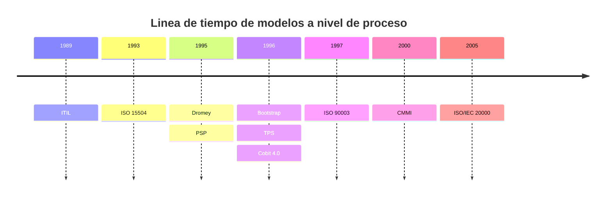

# Resumen de Calidad y métricas en los testeos

## Calidad de testeo
La calidad de software en el testeo se refiere al conjunto de acciones planificadas y sistemáticas necesarias para proporcionar la confianza adecuada de que un producto o servicio satisfará los requerimientos relativos a la calidad.

Para **asegurar la calidad del producto** se debe:
- Documentar las políticas aplicables
- Contar con los medios necesarios para el aseguramiento de la calidad
- Disponer de los recursos suficientes para monitorizar la calidad
- Implementar procedimientos de verificación sistemática
- Monitorizar resultados
- Aprender de los demás
- Compartir experiencias
- Adaptarse a los medios disponibles
- Mantenerse actualizado en la materia de calidad
- Ampliación de miras

### Como se construye un proceso de control de calidad

#### Ventajas de construir un proceso de control de calidad
- Aumento de beneficios
- Aumento del numero de clientes
- Motivación del personal
- Fidelidad de los clientes
- Organización del trabajo
- Mejora de las relaciones con los clientes
- Reducción de costes debidos a la mala calidad
- Aumento de la cuota de mercado

#### Partes del proceso de gestión
- “Estructura organizativa: departamento de calidad o
responsable de la dirección de la empresa.
- Cómo se planifica la calidad.
- Los procesos de la organización.
- Recursos que la organización aplica a la calidad.
- Documentación

Para construir un proceso de control de calidad de software, es necesario definir los parámetros, indicadores o criterios de medición que se utilizarán para evaluar la calidad del software. Estos criterios pueden incluir factores como la eficiencia, la fiabilidad, la usabilidad, la seguridad y la compatibilidad, entre otros. Una vez definidos los criterios, se deben establecer los procesos de control, que incluyen la selección del software que será controlado, la selección de las medidas que se aplicarán al objeto de control y la creación o determinación de los métodos de valoración de los indicadores. Además, se deben documentar las políticas y procedimientos aplicables, contar con los medios necesarios para el aseguramiento de la calidad y disponer de los recursos suficientes para monitorizar la calidad. De esta manera, se puede garantizar que el software cumpla con los estándares de calidad establecidos y que funcione correctamente sin defectos ni imperfecciones

La calidad del software debe implementarse a lo largo de todo el ciclo de vida, debe correr paralela desde la planificación del producto hasta la fase de producción del mismo.

Para ello se cuenta con una serie de ayudas, a través de distintas actividades para la implantación del control de calidad en el desarrollo de software
- Aplicación de metodología y técnicas de desarrollo
- Reutilización de procesos de revision formales
- Prueba del software
- Ajustes a los entandares de desarrollo
- Control de cambios, mediciones y recopilación de información
- Gestión de informes sobre el control de calidad

### Distintas normas internacionales que hablan de la calidad de software

Una **norma de calidad**, es un documento aprobado por un organismo reconocido, que proporciona un conjunto de reglas o directrices diseñadas para conseguir un grado mas optimo de orden en el contexto de la calidad.

La **estandarización** es toda actividad documentada que norma
el comportamiento de un grupo de personas

**Expectativas de los estándares:**
- Mejora de procesos de software acorde a los objetivos estratégicos
- Mejora de los productos
- Protección del cliente o usuario
- Protección de la organización (cultura de la organización y mejora continua)

#### Organizaciones internacionales de normalización
- ISO 9000
- Tick IT (Inglaterra)
- CMMI (Estados Unidos)
- Bootstrap (Europa)
- ISO/SPICE (Australia)

Los modelos de calidad de software también se clasifican de acuerdo con el enfoque de evaluación, ya sea a nivel de proceso, producto o calidad en uso.

- **Calidad a nivel de proceso:** La calidad de un sistema de software debe ser programado y mantenido a lo largo de su ciclo de vida, sino la calidad de este se vera afectado
- **Calidad a nivel de producto:** Este modelo esta centrado un verificar el cumplimiento de los criterios del producto
- **Calidad de uso:** Se define como el conjunto de atributos relacionados con el aceptación por parte del usuario final y seguridad

:::warning
Los conceptos de **"usabilidad"** y **"calidad de uso"** son diferentes, siendo **calidad de uso** el concepto mas abarcador entre los dos.
:::

#### Modelos a nivel de proceso

1. **ITIL (Information Technology Infrastructure Library):** ITIL es un conjunto de buenas prácticas para la gestión de servicios de tecnología de la información (TI). Se centra en la entrega de servicios de alta calidad a través de la planificación, el diseño, la implementación y la gestión de procesos de TI.

2. **ISO/IEC 15504 (SPICE - Software Process Improvement and Capability Determination):** Este estándar proporciona un marco para evaluar y mejorar los procesos de desarrollo y mantenimiento de software. Mide la capacidad de los procesos y establece niveles de madurez.

3. **Bootstrap:** Bootstrap es un modelo de proceso de software que se centra en la creación de procesos de desarrollo ágiles y efectivos para pequeñas empresas de software.

4. **Dromey:** Dromey es un modelo de calidad de software que se enfoca en la calidad de los datos y la información en los sistemas de software.

5. **PSP (Personal Software Process) y TSP (Team Software Process):** Estos modelos se centran en mejorar las habilidades y la productividad de los desarrolladores individuales y los equipos de desarrollo de software, respectivamente.

6. **IEEE/ EIA 12207:** Este estándar establece prácticas recomendadas para los procesos de ciclo de vida del software, desde la adquisición hasta el mantenimiento.

7. **ISO 90003:** Es una norma internacional que proporciona pautas para la aplicación de la norma ISO 9001 en el desarrollo de software y servicios relacionados.

8. **CMMI (Capability Maturity Model Integration):** CMMI es un modelo de mejora de procesos que ayuda a las organizaciones a evaluar y mejorar sus procesos de desarrollo y mantenimiento de software.

9. **ISO/IEC 20000:** Esta norma establece un conjunto de requisitos para la gestión de servicios de TI, incluyendo la gestión de servicios de software.

#### Modelos a nivel de producto

1. **McCall:** El modelo McCall se centra en la calidad del producto de software y define factores de calidad como la corrección, la confiabilidad y la eficiencia.

2. **GQM (Goal-Question-Metric):** GQM es una metodología que ayuda a las organizaciones a establecer objetivos de calidad, formular preguntas relevantes y definir métricas para evaluar el rendimiento del proceso.

3. **Boehm:** El modelo Boehm se centra en la gestión de proyectos de software y propone un conjunto de factores de costo y esfuerzo.

4. **Furbs (Functionality, Usability, Reliability, Performance, Supportability):** Este modelo se enfoca en cinco atributos clave de calidad del software: funcionalidad, usabilidad, confiabilidad, rendimiento y capacidad de mantenimiento.

5. **Gilb:** Gilb es un enfoque de inspección de calidad de software que se centra en identificar y resolver problemas de calidad de manera temprana en el ciclo de desarrollo.

6. **ISO 9126:** Define un conjunto de características de calidad del software, como la funcionalidad, la fiabilidad y la usabilidad.

7. **SQAE (Software Quality Assurance Engineering):** Este modelo se centra en las actividades de aseguramiento de calidad en el proceso de desarrollo de software.

8. **WebQEM (Web Quality Evaluation Model):** Es un modelo diseñado específicamente para evaluar la calidad de los sitios web.

9. **ISO 25000:** Esta norma proporciona un conjunto de estándares para evaluar la calidad del software y los sistemas de software, incluyendo la serie SQuaRE (Software Product Quality Requirements and Evaluation).

## Métricas de los testeos

### Que son las métricas de calidad de software

El **testing** controla la incertidumbre y controla los riesgos dando mas información de aspecto **cuantitativo**.

Las **métricas de calidad de software** permiten monitorizar un producto para determinar su nivel de calidad.

#### Importancia de las métricas de testeo

1. **Mejora de la calidad:** Las métricas de testeo son fundamentales para mejorar la calidad del software. Estas métricas permiten medir y evaluar la calidad de los procesos de prueba y del producto en sí, lo que ayuda a identificar áreas de mejora y tomar medidas para corregir problemas.

2. **Gestión eficiente:** La cita "Si algo no se puede medir, no se puede gestionar" resalta la importancia de las métricas para la gestión de proyectos de desarrollo de software. Las métricas proporcionan datos concretos que permiten tomar decisiones informadas y gestionar de manera más eficiente los recursos, el tiempo y el costo.

3. **Seguimiento del progreso:** Las métricas de testeo permiten realizar un seguimiento del progreso de las pruebas a lo largo del ciclo de vida del desarrollo de software. Esto es esencial para evaluar si se están cumpliendo los objetivos y si se están utilizando de manera óptima los recursos.

4. **Comunicación del progreso:** En el entorno actual, es crucial no solo ejecutar pruebas, sino también comunicar el progreso a lo largo del ciclo de desarrollo. Las métricas se utilizan para informar a las partes interesadas y a los equipos ejecutivos sobre el estado de calidad del software.

5. **Toma de decisiones:** Las métricas se utilizan para tomar decisiones relacionadas con la calidad del software. Ayudan a identificar fortalezas y debilidades, evaluar la eficiencia y la productividad del equipo de control de calidad, y comprender las expectativas del cliente.

6. **Evaluación de criterios de calidad:** El texto menciona cinco criterios clave de calidad de software (exactitud, rendimiento, usabilidad, configuración y eficiencia) y señala que las métricas son esenciales para evaluar el cumplimiento de estos criterios. Las métricas proporcionan una forma objetiva de medir y evaluar la calidad en cada uno de estos aspectos.

En resumen, las métricas de testeo son esenciales para evaluar, gestionar y mejorar la calidad del software a lo largo de su ciclo de vida de desarrollo. Ayudan a tomar decisiones informadas, comunicar el progreso y asegurar que el software cumpla con los criterios de calidad establecidos.

:::warning
A la hora de centrarse en la solución en si, existen algunas métricas de calidad de software imprescindibles, como las que tienen que ver con los cinco siguientes criterios:
:::

1. **Métricas de exactitud:** Intentan aportar información sobre la validez y precisión del software y su estructura, incluyendo la etapa de despliegue, pero también la de pruebas y la función de mantenimiento.
2. **Métricas de rendimiento:** A través de ellas se consigue medir el desempeño del software, tanto de cada uno de sus módulos como del sistema completo
3. **Métricas de usabilidad:** Buscan determinar si la solución es intuitiva y **user-friendly**.
4. **Métricas de configuración:** Las limitaciones, el estilo de código y todos los datos relativos al desarrollo y cualidades del producto se verán evaluados en base a esta métrica
5. **Métricas de eficiencia:** Minimización de latencias, velocidad de respuesta, capacidad, es un enfoque similar al de la productividad pero con un matiz un poco distinto, que añadido a aquel, aporta una visión mucho más completa de la solución

### Cual es el objetivo de las métricas de calidad

Cuando se trata de métricas de software en cuanto a los objetivos que persiguen, pueden clasificarse en cuatro grandes categorías, estas son:

1. Productividad del desarrollador
2. Rendimiento del software
3. Defectos y seguridad
4. Experiencia de usuario

#### Cómo se aplican las métricas de software

1. **Métricas de productividad del desarrollador**

Las métricas de productividad permiten a los gerentes de desarrollo ejecutar mejor los proyectos. Tabule una combinación de estas métricas de software para medir qué tan avanzado está un proyecto, los niveles de productividad del desarrollador, la cantidad de tiempo de desarrollo adicional necesario y más.

- **Tiempo de entrega (lead time):** tiempo que tarda algo de principio a fin
- **Cantidad de código:** Los equipos de desarrollo pueden mirar esta métrica de software, también llamada miles de líneas de código (KLOC), para determinar el tamaño de una aplicación
::: warning
tenga en cuenta que más código no siempre hace que el código sea eficiente o efectivo, lo que puede significar más trabajo de refactorización más adelante.
:::
- **Trabajo en curso (WIP):** Un equipo puede expresar WIP en un gráfico de quemado (burn down). estos gráficos muestran cuánto trabajo ha terminado el equipo y la cantidad de trabajo que queda por hacer
- **Velocidad ágil:** La velocidad ágil es una estimación de qué tan productivo será el equipo en un solo **sprint** (cuadro de tiempo).
- **Tasa de éxito de la meta del sprint:** Esta métrica de software calcula el porcentaje de elementos que completó el equipo de desarrollo en el **backlog** (reserva) del **sprint**
- **Número de versiones de software:** Con este **KPI**, los equipos pueden realizar un seguimiento de la frecuencia con la que lanzan software, ya sea mensual, semanal, diaria, por hora o en cualquier otro período de tiempo, y si esa cadencia finalmente ofrece suficiente valor comercial.

2. **Métricas de rendimiento del software**

El rendimiento del software se refiere a medidas **cuantitativas** del comportamiento de un sistema de software.
**Aspectos del desempeño del software**. Las pruebas de
rendimiento pueden evaluar las siguientes características de una aplicación:
- Escalabilidad
- Estabilidad
- Capacidad de respuesta
- Velocidad
- Disponibilidad

Otras expresiones importantes de métricas de rendimiento del software incluyen las siguientes.

- **Rendimiento (throughput):** El rendimiento es la cantidad de unidades de datos que procesa un sistema en un cierto período de tiempo.
- **Tiempo de respuesta:** mide cuánto tiempo tarda un sistema en responder a una consulta o demanda.
- **Fiabilidad, disponibilidad y capacidad de servicio (RAS):** RAS se refiere a la capacidad del software para cumplir constantemente con sus especificaciones; cuánto tiempo funciona en relación con la cantidad esperada; y con qué facilidad se puede reparar o mantener.

3. **Métricas de defectos**

Los equipos de desarrollo deben comprender cómo fallan las
aplicaciones para poder construirlas mejor. Estas métricas de desarrollo de software evalúan defectos y vulnerabilidades.

- **Densidad de defectos:** A nivel de código, los desarrolladores pueden tabular el número de defectos por **KLOC** para evaluar la frecuencia de los defectos.
- **Cobertura de código:** Esta es la proporción de código fuente que cubren las pruebas automatizadas.
- **Porcentaje de detección de defectos:** Esta métrica es una proporción de la cantidad de defectos encontrados antes de los lanzamientos de software en comparación con el número encontrado después del lanzamiento.
- **Deuda técnica:** La deuda técnica es una metáfora que refleja el esfuerzo a largo plazo, así como los costos temporales y financieros, de los desarrolladores que no abordan un problema de desarrollo cuando surge por primera vez.
- **Moral como métrica:** Trata la felicidad de los empleados o del equipo como otro indicador útil de la productividad y el éxito del equipo.
- **Vulnerabilidades de seguridad:** Identifican las debilidades de seguridad en una aplicación.
- **Incidentes de seguridad reales:**  Este **KPI** cuenta la cantidad de veces que un **hacker** aprovecha una vulnerabilidad en el software.
- **Tiempo medio de detección:** El tiempo medio de detección es un promedio que indica cuánto tiempo tarda un equipo en notar un problema o error.
- **Tiempo medio entre fallos:** Esta métrica es un cálculo de qué tan común es que un programa falle.
- **Tiempo medio de reparación:** El tiempo medio de reparación es el promedio que representa la rapidez con que un equipo aborda las fallas.

4. **Métricas de usabilidad y UX**

Las mediciones de UX suelen ser cualitativas
y pueden incluir las respuestas emocionales o corporales de los usuarios, como cuánto confían en el software y cómo se mueven sus ojos a través de una interfaz de usuario.

- **Métricas de usabilidad:** mide qué tan bien el software permite a los clientes alcanzar sus objetivos. La usabilidad se puede dividir en componentes más pequeños, como los siguientes:
  - Facilidad de descubrimiento
  - Eficiencia
  - Memorabilidad
  - Facilidad de aprendizaje
  - Satisfacción
  - Accesibilidad, particularmente accesibilidad digita
- **Net Promoter Score (NPS):** Esta métrica de software refleja la voluntad de los clientes de recomendar una aplicación a otros

### Importancia de las métricas de testeo

### Como se aplican las métricas de software