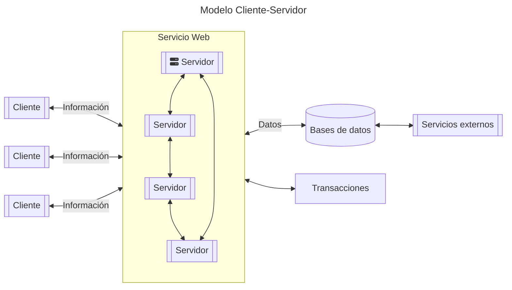
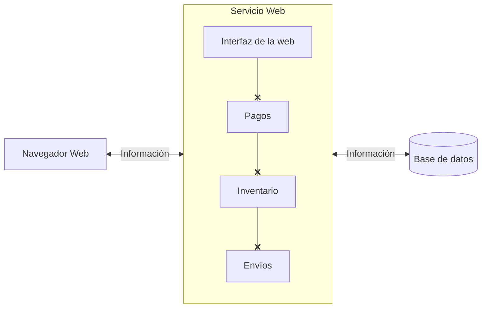
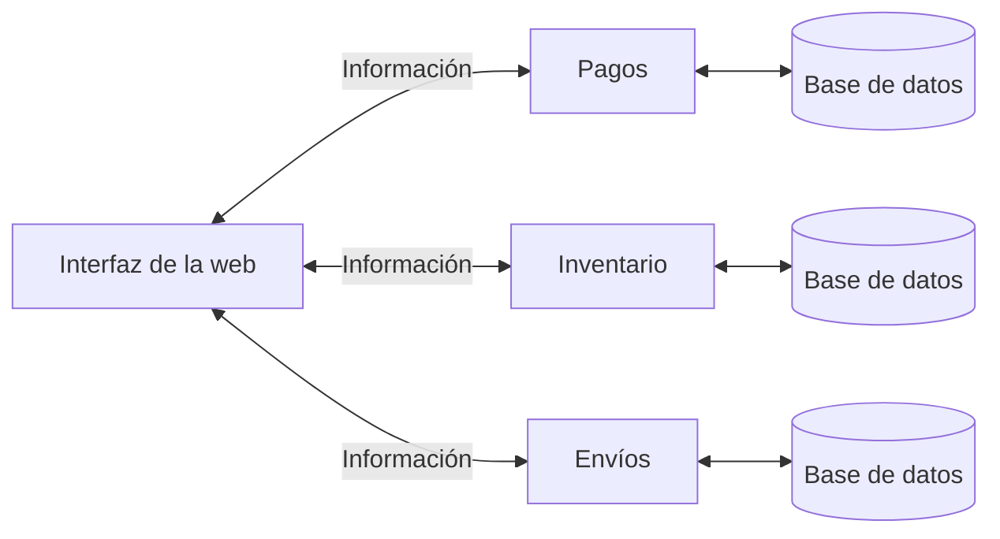

# Resumen de Modelos de sistemas distribuidos

## Introducción a distribución de servicios

### ¿Qué es este tipo de modelo?

Los sistemas distribuidos son aquellos en los cuales los componentes de hardware y de software están ubicados en computadoras de una red y en los cuales las acciones se comunican y coordinan solamente por medio de mensajes.

**Características**

- Colección de elementos de computación autónomos.
  - Constan de toda clase de nodos, desde computadoras de alto rendimiento a pequeños dispositivos.
  - Se programan para alcanzar objetivos comunes, gracias al intercambio de mensajes entre ellos.
  - Como consecuencia, no hay un reloj común
- Sistema coherente único. Transparencia.
  - Vista de sistema único a transparente al usuario fina
    - No se debería saber en qué nodo está ejecutando una tarea
    - No debería importar dónde se almacenen los datos
    - No debería importar si el sistema réplica datos para mejorar el rendimiento.
  - Conjunto de procesadores conectados por una red.
    - Sin memoria compartida.
    - Sistema débilmente acoplado.
  - No existe un reloj común.
  - Dispositivos de E/S asociados a cada procesador.
  - Fallos independientes de componentes del SD.
  - Carácter heterogéneo.
- Middleware
  - Los SD se organizan como una capa de software que es lógicamente separada entre una capa de alto nivel que consta de usuarios y aplicaciones y una capa subyacente formada por sistemas operativos y recursos básicos de comunicación.
  - Soporte a computadoras y redes heterogéneas.
  - Vista de un sistema único.
  - Un middleware a un SD es lo mismo que un SO a un computador: un gestor de recursos.
  - Para que sus aplicaciones compartan y desplieguen los recursos a través de una red.
- Otros servicios:
  - Comunicación entre aplicaciones.
  - Servicios de seguridad.
  - Servicios de contabilidad.
  - Enmascaramiento y recuperación de errores.

 

:::info
Un **middleware** (En sistemas distribuidos) es un software que facilita la comunicación y la integración entre diferentes aplicaciones, componentes y recursos en un sistema distribuido.
:::

:::info
Un **middleware** en el desarrollo de una aplicación en la gestión de rutas es un software que se encarga de interceptar y procesar las peticiones **HTTP** que llegan a la aplicación, y de enviar las respuestas adecuadas según la lógica de negocio. El **middleware** puede realizar diferentes funciones, como verificar la **autenticación** y autorización del usuario, **validar los datos** de entrada, **aplicar reglas de negocio**, **manejar errores**, **registrar eventos**, etc.
:::
 

| Ventajas | Desventajas |
| -------- | ----------- |
• Economía: buena relación rendimiento/costo. | • Necesidad de un nuevo tipo de software mas complejo y cuyo modelo no esta estandarizado |
| • Avances en tecnología de microprocesadores y redes de área local. | • La red de interconexión produce nuevos problemas: Perdida de información y latencia |
| • Alto rendimiento: procesamiento paralelo. | • Seguridad y confidencialidad. |
| • Soporte de aplicaciones inherentemente distribuidas. Por ejemplo: empresa distribuida geográficamente. | • Definición alternativa de SD. |
| • Capacidad de crecimiento: escalabilidad. | |
| • Capacidad de crecimiento: escalabilidad. | |
| • Carácter abierto y heterogéneo. | |

**Objetivos**

- Transparencia
  - Ocultar qué procesos y recursos están físicamente distribuidos a través de múltiples computadoras.
  - Un sistema es transparente si se presenta como una sola computadora.
- **Rendimiento**
  - Rendimiento para un servicio multi-usuario.
  - Rendimiento para la ejecución paralela de aplicaciones.
  - Factores: uso de esquemas caché.
  - Intentar que muchos accesos se hagan localmente.
    - Usos de esquema de replicación.
    - Reparto de carga entre componentes replicados.
      - En ambos casos: coste de mantener la coherencia.
- **Capacidad de crecimiento**
  - Diseño de un SD debe evitar "cuellos de botella".
  - Estrategias:
    - Reparto de estructuras de datos entre varios nodos.
    - Replicación y caché.
    - Realización de parte del procesamiento en los nodos cliente
- **Carácter abierto**
  - SD abierto: servicios, protocolos, etc. Publicados y estándares.
  - Facilita la interacción con otros sistemas abiertos.
  - Posibilita la migración de aplicaciones desde otros SD abiertos.
- Flexibilidad para cambiar y extender el SD.
  - Esconde heterogeneidad de HW, SO, lenguajes.
- **Fiabilidad**
  - Teóricamente: OR-lógico de sus componentes.
  - Sin embargo, a veces: AND-lógico de varios componentes.
  - Evitar componentes críticos (punto único de fallo).
  - Uso de replicación activa / pasiva:
    - Mantenimiento de coherencia entre réplicas.

### Tipos de sistemas

**Tipos de arquitecturas**

| Arquitectura | Entidades | Descripción | Ventajas | Desventajas |
| ------------ | --------- | ----------- | -------- | ----------- |
| Cliente-Servidor | • Servidor •Cliente| • Los clientes envían solicitudes al servidor para obtener recursos o servicios.  • El servidor gestiona recursos y responde a las solicitudes de los clientes.  • Comúnmente utilizado en aplicaciones web, servicios en la nube y bases de datos. | • Centralización facilita la gestión y seguridad de los recursos.  • Escalabilidad y control mejorados.  • Mayor estabilidad y disponibilidad del servicio. | • Puede haber cuellos de botella si el servidor se sobrecarga.  • Puede requerir un alto costo de infraestructura y mantenimiento.  • Puede tener problemas de escalabilidad si hay un aumento repentino en la demanda.
| Editor-Subscriptor | • Editor •Subscriptor | • Los editores crean y actualizan contenido que se distribuye a los subscriptores interesados.  • Los subscriptores reciben actualizaciones en función de sus intereses.  • Utilizado en sistemas de noticias, redes sociales y difusión de datos en tiempo real. | • Distribución eficiente de información personalizada a un público interesado.  • Escalabilidad para la difusión de contenido a gran escala.  • Reducción de la carga en los editores en comparación con un modelo Cliente-Servidor. | • Requiere una infraestructura más compleja para gestionar las suscripciones y distribuir contenido.  - Mayor complejidad en la lógica de suscripciones y actualizaciones.  • Puede tener problemas de privacidad si no se gestionan adecuadamente los datos del usuario. |
| Peer-to-peer (p2p) | • Pares | • Cada par (peer) puede actuar como cliente y servidor al mismo tiempo.  • Los pares colaboran directamente para compartir recursos o información sin un servidor central.  • Común en aplicaciones de intercambio de archivos, redes descentralizadas y criptomonedas. | • Descentralización y resistencia a la censura.  • Menor dependencia de un servidor central.  • Eficiente distribución de recursos en redes de pares. | • Puede haber problemas de confiabilidad debido a la variabilidad de la disponibilidad de los pares.  • La escalabilidad puede ser un desafío en redes grandes.  • Mayor complejidad en la gestión de la seguridad y la privacidad. |

**Tipos de sistemas distribuidos**

1. Sistemas computacionales
   1. **Distribuido tipo Cluster:** Estos sistemas consisten en un conjunto de computadoras interconectadas que trabajan en conjunto como una sola unidad para realizar tareas específicas. Los clústeres se utilizan comúnmente para mejorar el rendimiento y la disponibilidad de aplicaciones, ya que si una máquina falla, las demás pueden continuar funcionando. Cada clúster consta de una colección de nodos de cómputo controlados, y se accede a ellos mediante un solo maestro.
   2. **Distribuido tipo Grid:** Los sistemas distribuidos tipo grid son una infraestructura de cómputo que conecta y coordina recursos informáticos geográficamente dispersos. Estos sistemas constan de varias capas:
      1. **Capa de Fabricación:** Proporciona interfaces para recursos locales ubicados en un sitio específico. Suele ofrecer funciones para consultar el estado y las capacidades de un recurso. 
      2. **Capa de Conectividad:** Incluye protocolos de comunicación que respaldan transacciones que utilizan múltiples recursos. Facilita la comunicación y la coordinación entre los recursos distribuidos.
      3. **Capa de Recursos:** Administra la gestión de recursos individuales, utilizando funciones de la capa de conectividad y fabricación para acceder a estos recursos.
      4. **Capa Colectiva:** Se encarga de manejar el acceso a múltiples recursos. A diferencia de las capas anteriores, esta capa utiliza un conjunto estándar de protocolos relativamente pequeño para coordinar las operaciones de acceso a recursos distribuidos.
      5. **Capa de Aplicaciones:** Las aplicaciones que operan dentro de una organización virtual aprovechan el sistema de cómputo basado en grid para ejecutar tareas de manera distribuida y escalable.
2. Sistemas distribuidos de información
   1. **Sistemas de Procesamiento de Transacciones:** Estos sistemas se utilizan para gestionar transacciones comerciales y financieras en entornos distribuidos. Permiten el registro, seguimiento y procesamiento de transacciones en tiempo real, garantizando la integridad de los datos y la consistencia de la información en sistemas distribuidos.
   2. **Integración de Aplicaciones Empresariales:** La integración de aplicaciones empresariales se refiere a la interconexión de diferentes aplicaciones utilizadas en una organización para facilitar el intercambio de datos y la comunicación entre ellas. Estos sistemas permiten a las empresas optimizar procesos, mejorar la eficiencia y la toma de decisiones al garantizar que las aplicaciones puedan trabajar juntas de manera eficiente.
   3. **Sistemas Distribuidos de Información:** Este tipo de sistemas se centra en la gestión y distribución de información en entornos distribuidos. Su objetivo es proporcionar acceso a datos y recursos de información de manera eficiente y confiable en redes dispersas geográficamente. Los sistemas distribuidos de información pueden abordar desafíos como el almacenamiento distribuido, la búsqueda de datos, la replicación de información y la seguridad de la información en contextos empresariales y científicos, entre otros

### ¿Qué es la escalabilidad?
La escalabilidad es la propiedad deseable de un sistema, una red o un proceso, que indica su habilidad para reaccionar y adaptarse sin perder calidad, o bien manejar el crecimiento continuo de trabajo de manera fluida, o bien para estar preparado para hacerse más grande sin perder calidad en los servicios ofrecidos.

Existen distintas herramientas para trabajar o generar escalabilidad:
- Uso de software eficiente en tiempo y espacio.
- Patrones de diseño y de código para manejar eficientemente conexiones, **threads**, etc.
- Uso de cachés, consistencia eventual, replicación y balanceo de carga

**Tipos de escalabilidad**

- **Respecto a su tamaño:** Significa agregar recursos y usuarios fácilmente.
- **Respecto a su ubicación:** Indica que los usuarios y los recursos pueden estar muy lejos entre sí.
- **Respecto a la administración:** Esto significa que debe ser fácil de usar y manejar sin importar cuantas organizaciones compartan el mismo sistema distribuido.

### Dimensiones de escalabilidad en un sistema distribuido

#### Crecimiento vertical
Ocurre cuando se agregan más recursos a un nodo de la red. Escalar hacia arriba viene a significar una migración de todo el sistema a un nuevo hardware más potente y eficaz que el actual.

:::warning
Este modelo de escalabilidad tiene un aspecto negativo. Al aumentar la potencia con base en ampliaciones de hardware, llegará un momento que existirá algún tipo de limitación hardware. Además, a medida que se invierte en hardware de muy altas prestaciones, los costos se disparan tanto de forma temporal como económicos.
:::

#### Crecimiento horizontal
Sucede cuando se añade un nodo en la red. La escalabilidad horizontal consiste en potenciar el rendimiento del sistema desde un aspecto de mejora global, a diferencia de aumentar la potencia de una única parte del mismo. Este tipo de escalabilidad se basa en la posibilidad de modular su funcionalidad. Por ello suele estar conformado por una agrupación de equipos que dan soporte a la funcionalidad completa. Normalmente, en una escalabilidad horizontal se añaden equipos para dar más potencia a la red de trabajo

:::info
Si se aplica un modelo de escalabilidad basado en la horizontalidad, no existen limitaciones de crecimiento a priori
:::

 

:::warning
Este modelo de escalabilidad supone una gran modificación en el diseño, lo que conlleva a un gran trabajo de diseño y re-implantación.
:::

Dentro de la escalabilidad existe un concepto importante por la trascendencia que tiene la gestión de los recursos a la hora de compartir y distribuir la carga de trabajo de los mismos en ambas direcciones tanto horizontal como vertical; por esta razón es fundamental conocer sobre el balance de carga.

**Balanceador de carga**

Se entiende este concepto, como la técnica usada para dividir el trabajo a compartir entre varios procesos, ordenadores, u otros recursos. Para evitar los cuellos de botella, el balance de la carga de trabajo se reparte de forma equitativa a través de un algoritmo que estudia las peticiones del sistema y las redirecciona a la mejor opción.

**Balance de carga por hardware**

Presenta las siguientes características:

- A partir de un algoritmo (Round Robin, LRU), examina las peticiones HTTP entrantes y selecciona el más apropiado entre los distintos clones del sistema.
- La selección del clon del sistema está basada en el algoritmo de sustitución y es aleatoria.
- Este último punto provoca problemas en el diseño, ya que no garantiza que si un usuario realiza varias peticiones sean atendidas por el mismo clon del sistema. Por lo tanto, no hay mantenimiento de la sesión del usuario en el servidor y condiciona el diseño.
- La sesión debe de ser mantenida por el desarrollador.
- Al ser un proceso hardware, es muy rápido.

**Balance de carga por software**

- Examinan el paquete con respecto al protocolo HTTP para garantizar el mantenimiento de la sesión de usuario.
- Distintas peticiones del mismo usuario son servidas por el mismo clon del servidor.
- Más lentos que los balanceadores hardware.
- Normalmente son soluciones baratas.

---
## Microservicios

La arquitectura de microservicios es un método de desarrollo de aplicaciones software que funciona como un conjunto de pequeños servicios que se ejecutan de manera independiente y autónoma, proporcionando una funcionalidad de negocio completa. En ella, cada microservicio es un código que puede estar en un lenguaje de programación diferente, y que desempeña una función específica. Los microservicios se comunican entre sí a través de API, y cuentan con sistemas de almacenamiento propios, lo que evita la sobrecarga y caída de la aplicación.

**Visión monolítica**

La arquitectura monolítica es un enfoque tradicional de desarrollo de software en el que toda la aplicación se desarrolla como un único y gran código base. La visión central aquí es tener una aplicación cohesiva y fácil de mantener en un solo repositorio.

- Todos los componentes y funcionalidades de la aplicación están integrados en un solo código base.
- La aplicación se divide en módulos o capas, como la interfaz de usuario, la lógica de negocio y la base de datos, pero todos estos módulos están interconectados.
- Las actualizaciones o cambios en una parte de la aplicación pueden afectar a otras partes y requerir una implementación completa de la aplicación.

**Visión de microservicios**

La arquitectura de microservicios es un enfoque moderno en el que una aplicación se divide en pequeños servicios independientes que funcionan de manera autónoma. La visión principal aquí es lograr una mayor escalabilidad, flexibilidad y mantenibilidad.

- La aplicación se descompone en microservicios, que son componentes autónomos e independientes, cada uno con su propia lógica de negocio y base de datos.
- Los microservicios se comunican entre sí a través de API o protocolos específicos.
- Cada microservicio puede estar desarrollado en diferentes lenguajes de programación y tecnologías según las necesidades.

| Ventajas | Desventajas |
| -------- | ----------- |
| **Modularidad:** al tratarse de servicios autónomos, se pueden desarrollar y desplegar de forma independiente. Además, un error en un servicio no debería afectar la capacidad de otros servicios para seguir trabajando según lo previsto. | **Alto consumo de memoria:** al tener cada microservicio sus propios recursos y bases de datos, consumen más memoria y CPU. |
| **Escalabilidad:** como es una aplicación modular, se puede escalar horizontalmente cada parte según sea necesario, aumentando el escalado de los módulos que tengan un procesamiento más intensivo. | **Inversión de tiempo inicial:** al crear la arquitectura, se necesita más tiempo para poder fragmentar los distintos microservicios e implementar la comunicación entre ellos. |
| **Inversión de tiempo inicial:** al crear la arquitectura, se necesita más tiempo para poder fragmentar los distintos microservicios e implementar la comunicación entre ellos. | **Complejidad en la gestión:** si contamos con un gran número de microservicios, será más complicado controlar la gestión e integración de los mismos. Es necesario disponer de una centralización de trazas y herramientas avanzadas de procesamiento de información que permitan tener una visión general de todos los microservicios y orquesten el sistema. |
| **Rapidez de actuación:** el reducido tamaño de los microservicios permite un desarrollo menos costoso, así como el uso de “contenedores de software” permite que el despliegue de la aplicación se pueda llevar a cabo rápidamente. | **Perfil de desarrollador:** los microservicios requieren desarrolladores experimentados con un nivel muy alto de experiencia y un control exhaustivo de las versiones. Además de conocimiento sobre solución de problemas como latencia en la red o balanceo de cargas. |
| **Mantenimiento simple y barato:** al poder hacerse mejoras de un solo módulo y no tener que intervenir en toda la estructura, el mantenimiento es más sencillo y barato que en otras arquitecturas. | **No uniformidad:** aunque disponer de un equipo tecnológico diferente para cada uno de los servicios tiene sus ventajas, si no se gestiona correctamente, conducirá a un diseño y arquitectura de aplicación poco uniforme. |
| **Agilidad:** se pueden utilizar funcionalidades típicas (autenticación, trazabilidad, etc.) que ya han sido desarrolladas por terceros, no hace falta que el desarrollador las cree de nuevo. | **Dificultad en la realización de pruebas:** debido a que los componentes de la aplicación están distribuidos, las pruebas y test globales son más complicados de realizar. |
|  | **Coste de implantación alto:** una arquitectura de microservicios puede suponer un alto coste de implantación debido a gastos en infraestructura y en pruebas distribuidas. |

### La arquitectura de los microservicios

La mayor parte de las arquitecturas de microservicios tienen las siguientes características:

**Los componentes son servicios:** La principal manera de crear componentes es mediante la inserción de un botón que automáticamente por detrás, gestione la descomposición en servicios en lugar de bibliotecas. Los servicios son componentes separados que se comunican mediante mecanismos como los servicios web o los RPC en lugar de usar llamadas a funciones en memoria como hacen las bibliotecas.

**Organizada en torno a las funcionalidades del negocio:** El sistema se divide en distintos servicios donde cada uno está organizado en torno a una capacidad del negocio. Es muy importante limitar la responsabilidad de cada servicio. Cada servicio implementa toda la funcionalidad del negocio que agrupa desde la interfaz de usuario, la persistencia en el almacenamiento y cualquiera de las colaboraciones externas.

**Productos, no proyectos:** En esta arquitectura normalmente se sigue la idea de que un equipo debe estar a cargo de un componente (servicio). 

**Extremos inteligente:** Las aplicaciones creadas desde microservicios pretenden ser tan disociadas y cohesivas como sea posible, ellas poseen su propia lógica de dominio y actúan como filtros en el clásico sentido **UNIX**.

**Tener un gobierno descentralizado permite usar tecnologías que se adapten mejor a cada funcionalidad:** Con el sistema con múltiples servicios colaborativos, podemos decidir utilizar diferentes lenguajes de programación y tecnologías dentro de cada servicio.

**Gestión de datos descentralizada:** Los microservicios prefieren dejar a cada servicio que gestione su propia base de datos, sean estas diferentes instancias de la misma tecnología de base de datos o sistemas de base de datos completamente diferentes.

**Diseño tolerante a fallos:** Las aplicaciones necesitan ser diseñadas de modo que puedan tolerar las fallas de los distintos servicios. Patrones más importantes para conseguir estabilidad que se usan en la arquitectura de microservicios:
- Reintento: Consiste en repetir una operación para la cual finalizó su tiempo de espera.
- **Encolar para reintentar** la operación para ser realizada más tarde
- **Disyuntores:** Funcionan de forma similar a los interruptores automáticos accionados por sobrecargas que hay en las instalaciones eléctricas. En el software existen para permitir que un subsistema ante una falla no destruya el sistema entero por sobrecarga y una vez que el peligro ha pasado pueda restablecerse.
- **Compartimentos estancos** para contención de daños manteniéndolos aislados

**Automatización de la infraestructura:** La mayoría de los productos y sistemas desarrollados con el enfoque de
microservicios han sido construidos por equipo que usan entrega continua y su precursor la integración continua.
Para conseguir esto es necesario:

- **Automatizar todo el proceso**, desde el chequeo del código, pruebas y despliegue.
- **Control de versiones y gestión de configuración.** Todo el software tiene que estar versionado y poder gestionar las distintas configuraciones para conseguir la entrega continua.
- **Arquitectura adecuada.** La arquitectura tiene que permitir realizar cambios sin que afecten al resto del sistema. La arquitectura de microservicios lo hace posible.

**Diseño evolutivo.** Cuando se divide el sistema en servicios hay que tener en cuenta que cada uno tiene que poder ser reemplazado o actualizado de forma independiente.

**Seguridad de la arquitectura de microservicios**
- Los microservicios simplifican el monitoreo.
- Alivia algunos problemas de seguridad que surgen en aplicaciones monolíticas.
- Una brecha de seguridad podría ocurrir en una sección sin afectar otras áreas del proyecto
- Ofrecen resistencia ante ataques **DDoS**.

Sin embargo, todavía existen desafíos al proteger aplicaciones de microservicios, que incluyen:

- Más áreas de red están abiertas a vulnerabilidades.
- Una menor coherencia general entre las actualizaciones de la aplicación permite más violaciones de seguridad.
- Hay una mayor área de ataque, a través de múltiples puertos API.
- Hay una falta de control de software de terceros.
- La seguridad debe mantenerse para cada servicio.

**Despliegue de aplicaciones de microservicio**

Existen 3 conceptos que facilitan el despliegue de aplicaciones de microservicios:

1. **Contenedores:** Los contenedores son una tecnología de virtualización a nivel de sistema operativo que permite empacar una aplicación y todas sus dependencias en una unidad única llamada **"contenedor"**. Estos contenedores son portátiles y pueden ejecutarse de manera consistente en cualquier entorno que admita la tecnología de contenedores, como **Docker**.
2. **Orquestación:** se refiere a la gestión automatizada y coordinación de múltiples componentes o servicios de una aplicación distribuida. En el mundo de los contenedores, la orquestación se utiliza para administrar y escalar contenedores de manera eficiente, gestionar el **balanceo de carga**, **asegurar la alta disponibilidad** y **facilitar la implementación y actualización** de aplicaciones en entornos de contenedores. **Kubernetes** es una de las herramientas de orquestación de contenedores más populares y ampliamente utilizadas.
3. **Malla:** Una malla de servicio es una capa de infraestructura que se utiliza para administrar la comunicación entre los diferentes componentes de una aplicación distribuida. Proporciona funciones como el **descubrimiento de servicios**, **el equilibrio de carga**, **la seguridad**, **la monitorización** y la **gestión del tráfico**, entre otras. Ejemplos de mallas de servicio populares son **Istio** y **Linkerd**.

### ¿Cómo utilizar los microservicios?

Estos son los cinco elementos que un microservicio necesitará antes de que pueda utilizarse en una arquitectura de aplicación distribuida

1. **Funcionalidad con un alcance adecuado.** El primer elemento de un microservicio es definir lo que debe hacer. Una forma de definir el ámbito adecuado es particionar los servicios a lo largo de las líneas de funcionalidad lógica. Otro enfoque de alcance es reflejar la estructura de la organización de desarrollo. Un tercer enfoque es minimizar un servicio a la cantidad de código que podría ser reintroducido por el equipo en un período de dos semanas.
2. **Preparación de una API.** Una vez que descomponemos una aplicación en múltiples servicios que cooperan, ¿cómo deben hablar esos servicios entre sí? Normalmente, esto se hace con llamadas a API de servicios web REST, aunque también pueden utilizar otros mecanismos de transporte. Una buena idea es evitar saltar a la codificación de la API de forma inmediata. En su lugar es mejor hacer algún trabajo en papel o pizarra para definir lo que un servicio específico debe exponer para funcionar correctamente.
3. **Gestión del tráfico.** Desde la perspectiva del servicio de llamada, siempre debe realizar un seguimiento de sus llamadas y estar preparado para terminar si la respuesta toma demasiado tiempo. Desde la perspectiva del servicio llamado, el diseño de API debe incluir la posibilidad de enviar una respuesta que indique sobrecarga. Los servicios deben ser capaces también de generar y matar nuevas instancias de servicio según sea necesario para acomodar variaciones en la carga de tráfico.
4. **Descarga de datos.** Tener necesidad de una operación continua es muy diferente de lo que necesitan las aplicaciones tradicionales, que a menudo dejan de funcionar si falla la infraestructura subyacente. Para asegurarse de que los usuarios pueden seguir trabajando cuando falla una instancia, se pueden migrar datos específicos del usuario fuera de las instancias de servicio a un sistema compartido de almacenamiento redundante accesible desde todas las instancias de servicio. Otro enfoque de descarga de almacenamiento es insertar un sistema compartido de caché basado en memoria entre un servicio dado y el almacenamiento asociado con ese servicio.
5. Monitorización. El sistema de monitorización de una aplicación basada en una arquitectura de microservicios debe permitir el cambio continuo de recursos, ser capaz de capturar datos de monitorización en una ubicación central y mostrar información que refleje la naturaleza con frecuencia cambiante de las aplicaciones de microservicios.

### Características de los microservicios en distintos lenguajes

**Patrones de diseño**

- **Creacionales:** Aquellos que tratan con las formas de crear instancias de objetos y cuyo objetivo es abstraer el proceso de instanciación y ocultar los detalles de cómo los objetos son creados o inicializados. En esta clase, se encuentran los siguientes:
  - Abstract factory
  - Builder
  - Factory method
  - Prototype
  - Singleton
- **Estructurales:** Aquellos que describen cómo las clases y objetos (simples o compuestos) pueden ser combinados para formar grandes estructuras y proporcionar nuevas funcionalidades. En esta clase, se encuentran los siguientes:
  - Adapter
  - Bridge
  - Composite
  - Decorator
  - Facade
  - Flyweight
  - Proxy
- **Comportamiento:** Aquellos que nos ayudan a definir la comunicación e iteración entre los objetos de un sistema. El propósito de este patrón es reducir el acoplamiento entre los objetos. En esta clase se encuentran los siguientes:
  - Chain of responsibility
  - Command
  - Interpreter
  - Iterator
  - Mediator
  - Memento
  - Observer
  - State
  - Strategy
  - Template method
  - Visitor
- Otros:
  - Arquitectura en pizarra
  - DAO: Data Access Object
  - DTO: Data Transfer Object
  - EDA: arquitectura dirigida por eventos
  - Invocación implícita
  - Objetos desnudos
  - Programación por capas
  - Peer-to-peer
  - Pipeline
  - SOA: arquitectura orientada a servicios
  - Modelo/Vista/Controlador
  - Modelo/Vista/Presentador
  - Modelo/Vista/Presentador con Presentador del Modelo
  - Modelo/Vista/Vista-Modelo
  - Modelo/Vista/Presentador con Vista Pasiva
  - Modelo/Vista/Presentador con Controlador Supervisor

**Lenguajes de programación, su arquitectura y características**

**Docker**

Docker es una plataforma de código abierto que se utiliza para desarrollar, implementar y ejecutar aplicaciones en contenedores. Los contenedores son entornos ligeros y portátiles que incluyen todo lo necesario para ejecutar una aplicación, como el código, las bibliotecas y las dependencias. Docker simplifica la gestión de aplicaciones al encapsularlas en contenedores, lo que facilita su despliegue en diferentes entornos, como servidores locales, nubes públicas o entornos de desarrollo.

Para ejecutar contenedores, hay dos tipos de tiempos de ejecución:

- Los contenedores de Windows Server ofrecen aislamiento de aplicaciones a través de tecnología de aislamiento de proceso y de espacio de nombres. Un contenedor de Windows Server comparte el kernel con el host de contenedor y con todos los contenedores que se ejecutan en el host.
- Los contenedores de Hyper-V amplían el aislamiento que ofrecen los contenedores de Windows Server mediante la ejecución de cada contenedor en una máquina virtual altamente optimizada. En esta configuración, el kernel (núcleo) del host (anfitrión) del contenedor no se comparte con los contenedores de Hyper-V, lo que proporciona un mejor aislamiento.

La aplicación consta de estos tipos de componentes:

- Componentes de presentación. Estos componentes son los responsables del control de la interfaz de usuario y el consumo de servicios remotos.
- Lógica de dominio o de negocios. Este componente es la lógica de dominio de la aplicación.
- Lógica de acceso a bases de datos. Este componente está formado por componentes de acceso a datos responsables de acceder a las bases de datos (SQL o NoSQL).
- Lógica de integración de aplicaciones. Este componente incluye un canal de mensajería basado en agentes de mensajes.