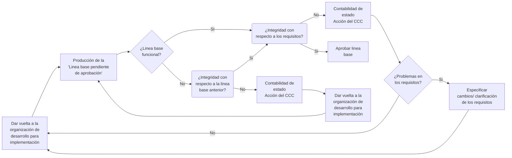
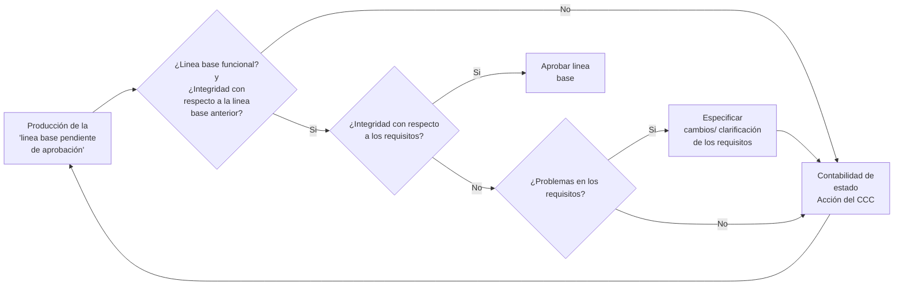

# Resumen de Software Configuration Management

## Principios generales de software configuration management (SCM)

**SCM** o **Software Configuration Management**, se define como la disciplina cuyo objetivo es la identificación del software en ciertos momentos y el control sistemático de cambios a la configuración con el propósito de mantener la integridad, calidad y estandarización del software.

**Ventajas**
1. Resolución más rápida de los problemas.
2. Gestión de cambios más eficiente.
3. Reducción de costes.
4. Control de licencias.
5. Mayores niveles de seguridad.
6. Mayor rapidez en la restauración del servicio.

**Posibles desventajas**
1. Una incorrecta planificación
2. Estructura inadecuada de la **CMDB**
3. Herramientas inadecuadas.
4. Falta de coordinación con la gestión de cambios y versiones.
5. Falta de organización.
6. Falta de compromiso.

:::info
**CMDB**: configuration management data base o base de datos de la gestión de configuración, un concepto que introduce ITIL 4 – ISO/IEC 20000¹ para facilitar la gestión de los servicios TI.
:::

**Tareas de un GCS (Gestor de configuración de software)**
1. Planificación
2. Clasificación y registro.
3. Monitorización y control.
4. Realización de auditorías.
5. Elaboración de informes.

**Actividades que conforman el proceso de gestión de configuración**

| Actividad | Responsable | Descripción | Entradas | Salidas |
| --------- | ----------- | ----------- | -------- | ------- |
| Gestión del proceso de gestión de configuración | Gestor de configuración | Documentar el plan de gestión de configuración | • Necesidades del proyecto  • Plan de proyecto  | • Plan de gestión de configuración aprobado  |
| Identificación de elementos de configuración | Gestor de configuración | Identificar elementos de configuración. Crear estructura del directorio de gestión de configuración | Productos del proyecto | • Elementos de configuración identificados  • Línea base  • Estructura del directorio de gestión de configuración  |
| Mantenimiento y control de la gestión de configuración | Responsable del elemento de configuración | Control de cambios sobre elementos de configuración y líneas base. Obtener aprobación de solicitudes de cambio sobre productos de trabajo de línea base | • Peticiones de cambio  | • Registro de solicitud de cambio  • Solicitud de cambio aprobada  • Línea base 
| Informe de estado de la configuración | Gestor de configuración | Mantener actualizado y publicar el estado de los elementos de configuración | • Elementos de configuración  | • Informe de estado de elementos de configuración  |
| Verificación y auditoría | Gestor de configuración | Realizar auditorías de la gestión de configuración | • Registros de la gestión de configuración  • Línea base  • Registros de cambios  | • Informe de auditoría de gestión de configuración  |

**Características**
1. **Administración de concurrencia:** se refiere a la edición simultánea de un archivo por más de una persona y su correcta integración.
2. **Gestión de configuraciones:**
   1. **Identificación de configuración:** El proceso de identificar los atributos que definen cada aspecto de un elemento de configuración. Un elemento de configuración es un producto que tiene el propósito de ser presentado al usuario.
   2. **Control de configuración:** es un grupo de procesos y etapas de aprobación requeridas para cambiar los atributos de un SCI y cambiar sus líneas de base.
   3. **Auditoría de configuración:** asegura que el funcionamiento de un SCI cumpla con las metas.
   4. **Reporte de status (posición) de configuración:** es la habilidad de grabar y reportar sobre las configuraciones de líneas de base asociadas con cada SCI en cualquier momento.
3. **Control de versiones:** se refiere al rastreo de revisiones de archivos, el cual hace posible recrear una versión anterior del archivo. Esto se logra creando una copia de cada archivo en el repositorio central.
4. **Sincronización:** para esto, cada miembro del proyecto baja periódicamente la versión más actual del proyecto y, luego de realizar el trabajo, se actualiza en el repositorio.

**Elementos que componen el proceso de gestión de configuración**
- **Versión:** es una instancia de un elemento de configuración. El término se usa para señalar a un elemento de configuración del software que tiene un conjunto definido de características funcionales.
- **Revisión:** se define como una versión que se construye sobre otra versión anterior. El término revisión generalmente se asocia a la noción de corrección de errores.
- **Variante:** versión que es una alternativa a otra versión. Las variantes pueden permitir a un ECS satisfacer requerimientos en conflicto. Una variante es una nueva versión de un elemento que será añadida a la configuración sin reemplazar a la versión anterior.
- **Entrega o release:** es una instancia del sistema distribuida a los clientes.
- **Línea base o baseline:** es una especificación o producto revisado y aprobado formalmente, que sirve como base para el desarrollo posterior, y puede ser modificado solo a través de procedimientos formales de control de cambios.
- **Revisión técnica formal (RTF):** corrección técnica del objeto de configuración que se ha modificado; se la debe realizar en casi la mayoría de los cambios triviales.
- **Repositorio:** almacenamiento centralizado de los componentes de un mismo sistema, incluyendo las distintas versiones de cada componente.

### ¿Para qué sirve el software configuration management (SCM)?

1. Provee la habilidad de dar seguimiento a los cambios durante el desarrollo, sea este secuencial o en paralelo.
2. Organiza las tareas y actividades que mantienen la integridad del software.
3. Asegura la configuración correcta del software.
4. Asegura que los ingenieros apliquen cambios correctamente en la línea base o en la versión del software.
5. Ayuda a reducir el costo de la mantención del ciclo de vida del software, que puede ser fácilmente excedido.
6. Provee información para reportes que pueden ser fácilmente generados.
7. Permite realizar auditorías rápidas y fáciles.
8. Ayuda en la producción de un software de mayor calidad.

###  Herramientas para el desarrollo de software

Un sistema de gestión de configuración permite establecer y mantener la consistencia de la funcionalidad, rendimiento y atributos de configuración de un producto o servicio a lo largo de toda su vida operativa. Las finalidades de un sistema de administración de configuraciones son:
- **Centralizar las tareas de configuración de servidores y software** en un repositorio de configuraciones común a toda la infraestructura que se desea administrar, reduciendo tiempos y errores.
- **Versionamiento y control de cambios** a lo largo del tiempo de vida de la infraestructura que se desea administrar, teniendo en cuenta que está sujeta a cambios y/o modificaciones con el tiempo que serían difícil e ineficiente seguir de manera manual, por otro lado, la respuesta ante un error o la necesidad de volver a una configuración anterior puede realizarse de manera automatizad.
- **Tiempos de configuración y aprovisionamiento**. La automatización controlada permite la configuración y aprovisionamiento de una gran y compleja infraestructura TI reduciendo los tiempos y riesgos que se tienen al realizar estas tareas de forma manual aplicándose a cada servidor o software a la vez.

| Herramienta | Descripción | Funcionalidades | Ventajas | Desventajas |
| ----------- | ----------- | --------------- | -------- | ----------- |
| Puppet | Sistema de automatización de configuración que utiliza un lenguaje de dominio específico (DSL) para definir la configuración de sistemas.  | • Gestión de configuraciones declarativas.  • Despliegue automatizado de software y configuraciones. • Escalabilidad.  • Informes detallados.  | • Gestión centralizada de configuraciones.  • Abundante comunidad y módulos.  • Soporte multiplataforma.  • Declarativo y fácil de aprender.  | • Configuración inicial puede ser compleja.  • Requiere un servidor maestro.  • Más adecuado para configuraciones complejas.  |
| Chef | Otra herramienta de automatización de configuración que utiliza código Ruby para definir la configuración.  | • Infraestructura como código.  • Administración centralizada.  • Soporte de múltiples plataformas.  • Control granular de configuraciones.  | • Flexibilidad para definir configuraciones.  • Administración centralizada.  • Extensibilidad mediante Ruby.  • Soporte multiplataforma.  | • Curva de aprendizaje empinada para Ruby.  • Requiere infraestructura adicional.  • Requiere mantenimiento constante.  |
| Ansible | Herramienta de automatización de configuración y gestión de sistemas que utiliza YAML para definir tareas y roles | • Automatización de tareas.  • Despliegue de aplicaciones.  • Orquestación de múltiples servidores.  • Gestión de configuraciones sin agentes.  | • Configuración sin agentes.  • Fácil de aprender y usar.  • Amplia adopción y comunidad.  • No requiere una infraestructura especial.  | • Menos adecuado para configuraciones complejas.  • Limitado en entornos Windows.  • Menos control granular en comparación con otros.  |
| SaltStack | Plataforma de automatización y gestión de configuraciones que utiliza Python para definir configuraciones.  | • Automatización de configuraciones.  • Escalabilidad.  • Gestión de eventos y orquestación.  • Comunicación en tiempo real.  | • Alta velocidad de ejecución.  • Escalabilidad y rendimiento.  • Gestión centralizada.  • Soporte para eventos y orquestación.  | • Curva de aprendizaje empinada para Python.  • Requiere infraestructura de minions.  • Documentación menos extensa.  |
| CVS | Sistema de control de versiones centralizado que rastrea cambios en archivos y directorios.  | • Control de versiones de archivos y directorios.  • Historial de cambios.  • Etiquetado y ramificación.  • Colaboración en equipos.  | • Fácil de entender y usar.  • Gestión centralizada de versiones.  • Historial de cambios detallado.  • Compatibilidad con sistemas antiguos.  | • No es adecuado para flujos de trabajo distribuidos.  • Menos eficiente con grandes repositorios.  • Conflictos frecuentes.  |
| Jenkins | Herramienta de integración continua que automatiza la construcción y despliegue de software.  | • Integración continua.  • Entorno de entrega continua (CI/CD).  • Automatización de la construcción y despliegue.  • Gestión de artefactos.  | • Amplia integración con otras herramientas.  • Configuración flexible.  • Escalabilidad.  • Gran cantidad de complementos disponibles.  | • Requiere hardware adicional para ejecución continua.  • Curva de aprendizaje para configuración avanzada.  • Complejidad en entornos distribuidos.  |
| Gitlab | Plataforma de desarrollo de software que incluye control de versiones, integración continua y más.  | • Control de versiones de código fuente.  • Integración continua y entrega continua (CI/CD).  • Gestión de proyectos.  • Repositorios de Git integrados.  | • Integración integral con Git.  • Gestión de repositorios y CI/CD en un solo lugar.  • Comunidad activa y actualizaciones frecuentes.  | • Puede requerir recursos significativos para instalación propia.  • Curva de aprendizaje para configuración avanzada.  • Menos versatilidad que Jenkins en algunos casos.  |
| Mercurial | Sistema de control de versiones distribuido similar a Git.  | • Control de versiones distribuido.  • Eficiencia en operaciones comunes.  • Soporte multiplataforma.  • Buen manejo de binarios.  | • Fácil de aprender y usar.  • Rendimiento rápido en operaciones comunes.  • Buen soporte multiplataforma.  • Buen manejo de binarios.  | • Menos popular y menos herramientas de terceros en comparación con Git.  • Menos adecuado para grandes proyectos.  • Limitado en funciones avanzadas.  |
| Bazaar | Sistema de control de versiones distribuido que prioriza la simplicidad y la facilidad de uso.  | • Control de versiones distribuido.  • Simplicidad y facilidad de uso.  • Interoperabilidad con otros sistemas VCS.  • Rendimiento adecuado para proyectos pequeños y medianos.  | • Muy fácil de aprender y usar.  • Interoperabilidad con otros sistemas VCS.  • Buen rendimiento con proyectos pequeños y medianos.  | • Menos características avanzadas en comparación con Git.  • Menos popular y menos herramientas de terceros.  • Escalabilidad limitada.  |

### Ítems de configuración
Un item de configuración es todo o parte de un producto de trabajo (por ejemplo, un documento, todos los casos de prueba o un componente de programa nominado).

Los ítems de configuración se organizan para formar elementos que puedan catalogarse con un solo nombre en la base de datos del proyecto.

**¿Qué es un elemento?**

Un **elemento** es la parte del producto final que se selecciona para mantener bajo control toda su configuración; pero, a su vez, no todos los elementos deben mantenerse bajo control de configuración, se deben seleccionar cuáles se mantienen y cuándo se suman al proceso.

**proceso de identificación de la configuración**

- La tarea de identificación empieza con la **definición de los elementos de la configuración de software** representativos de los productos en cada línea base establecida. El formato, los contenidos y los mecanismos de control para toda la documentación son definidos para enlazar la información cuando la jerarquía de la configuración se despliega.
- **Se asignan identificadores apropiados** a todos los programas, documentos y periféricos, usando un esquema numerado que proporciona información sobre el elemento de la configuración software.
- Finalmente, **la identificación debe facilitar el control de cambios**, para acomodar actualizaciones y modificaciones.

**Enfoques fundamentales para el control de la documentación**
1. Todos los documentos software y otros elementos de cada configuración son mantenidos como parte de una biblioteca de esquema/documentación de ingeniería ya establecida.
2. Se establece una librería de software especial para todas las configuraciones software.
3. Se establece una librería de software online, soportada por un procesador de textos y facilidades de recuperación de documentos accedidos por terminales de computadora.

---

##  Control y seguimientos de cambios del software

###  Control de la configuración

El control de la configuración es la actividad de administrar los entregables o productos del proyecto y los documentos relacionados, durante todo el ciclo de vida del producto. Las acciones que esta actividad implica son:

- Identificar los elementos del proyecto que deben estar bajo configuración.
- Restringir los cambios a dichos elementos.
- Auditar los cambios a estos elementos.
- Definir y gestionar la configuración de estos elementos.

Este control ayuda a eliminar la posibilidad de confusiones que pueden resultar de alto costo para el proyecto y asegurar que no existan inconsistencias en el sistema desarrollado, generadas por los elementos que se describen a continuación:
- Actualizaciones simultaneas
- Problemas en la notificación de cambios
- Múltiples versiones

Beneficios de una buena gestión de configuración y control de cambios:
- Brindar apoyo a los métodos de desarrollo de software.
- Mantener la integridad del producto.
- Asegurar la completitud y correctitud de los elementos bajo configuración.
- Proveer un ambiente estable y controlado de trabajo.
- Restringir y controlar los cambios que se realizan.
- Proveer mecanismos de rastreo de por qué, cuándo y quién realizó un cambio.

**Tipos de cambios**
- **Corrección de un defecto:** los clientes tienden a clasificar todos los cambios en esta categoría.
- **Mejora del sistema:** los programadores, sin embargo, los suelen clasificar aquí.

**Niveles de control de cambios:**

- **Control de cambios informal:** antes de que el elemento de configuración del software pase a formar parte de una línea base, aquel que haya desarrollado el elemento de configuración del software podrá realizar cualquier cambio justificado sobre él.
- **Control de cambios al nivel del proyecto o semiformal:** una vez que el elemento de configuración del software pasa la revisión técnica formal y se convierte en una línea base, para que el encargado del desarrollo pueda realizar un cambio debe recibir la aprobación de parte de los siguientes grupos:
  - **El director del proyecto**, si es un cambio local.
  - **El Comité de Control de Cambios**, si el cambio tiene algún impacto sobre otros elementos de configuración del software
  - **Control de cambios formal:** se suele adoptar una vez que se empieza a comercializar el producto, cuando se transfieren los **ECS** a la Biblioteca Maestra. Todo cambio deberá ser aprobado por el Comité de Control de Cambios.

Es necesario establecer, de forma precisa, al comienzo de cada proyecto, cuál será el proceso de gestión de cambios que se va a utilizar. Para ello, será necesario definir:

- Políticas a nivel organizativo que promuevan las actividades de control de cambios.
- Los estándares que se van a adoptar y a los que será necesario ajustarse.
- Los procedimientos que se van a utilizar para poner en práctica las políticas de gestión de configuración.

**Proceso de control de cambios**
1. **iniciación del cambio:** se presenta una solicitud de cambio, que puede venir provocada por un problema que se ha detectado o por un cambio en los requisitos.
2. **Clasificación y registro de la solicitud de cambio**.
3. **Aprobación o rechazo inicial de la solicitud de cambio**. De ello suele ser responsable el Comité de Control de Cambios.
4. **Evaluación de la solicitud de cambio**, si ha sido aprobada, para calcular el esfuerzo técnico, los posibles efectos secundarios, el impacto global sobre otras funciones del sistema y el coste estimado del cambio. Como resultado se obtiene un informe de cambio.
5. **Se presenta el informe de cambio al Comité de Control de Cambios**. Si se considera que el cambio es beneficioso, se genera una orden de cambio (también llamada orden de cambio de ingeniería), que describe el cambio a realizar, las restricciones que se deben respetar y los criterios de revisión y de auditoría. Esta orden de cambio es asignada a alguno de los ingenieros de software para que se encargue de llevarlo a cabo. En este momento, el objeto a cambiar se da de baja en la Biblioteca de Soporte al Proyecto.
6. **Se realiza el cambio**, entrando en un proceso de seguimiento y control.
7. Una vez finalizado el cambio, **se certifica**, mediante una revisión, que se ha efectuado correctamente el cambio y con ello se ha corregido el problema detectado o bien se han satisfecho los requisitos modificados. El objeto se devuelve a la Biblioteca de Soporte al Proyecto.
8. **Se notifica el resultado al originador del cambio**.

Los procesos de alta y baja de la Biblioteca del Proyecto implementan dos elementos importantes del
control de cambios: el control de acceso y el control de sincronización

1. El **control de acceso** se refiere a los derechos que tienen los diferentes miembros del equipo de desarrollo para acceder y modificar ECS concretos. Así, por ejemplo, hay que controlar el acceso del ingeniero de software que da de baja el ECS de la Biblioteca de Proyecto para realizar un cambio aprobado por una orden de cambio.
2. El **control de sincronización** ayuda a asegurar que los cambios en paralelo, realizados por equipos o personas diferentes, no se sobrescriben. Así, cuando un ECS se da de baja de la Biblioteca de Soporte, el control de sincronización bloquea el objeto para que no se puedan hacer más actualizaciones sobre él hasta que se haya reemplazado con una nueva versión. El almacén de una herramienta de control de versiones se puede considerar como la Biblioteca de Soporte o de Proyecto. Estas herramientas ofrecen también de forma automática el control de acceso y control de sincronización.

### Estado de cuenta

El estado de cuentas guarda contabilidad actual de una configuración y proporciona la trazabilidad de los elementos de configuración a lo largo de su desarrollo y funcionamiento. Los informes de estado regulares indicarán si las solicitudes de cambio se procesan de manera oportuna y pueden resaltar los productos que son objeto de frecuentes solicitudes de cambio o partes interesadas que son fuentes comunes de las solicitudes de cambio.

### Auditorías de configuración

Una auditoría de configuración física (PCA) identifica los componentes de un producto que se van a desplegar desde el repositorio de proyectos.

:::info
Esta función a veces se considera fuera de la gestión de configuración y dentro de la garantía de calidad. Esta es la actividad de GCS más costosa y debe ser realizada por personal ajeno al equipo de desarrollo técnico para mantener la objetividad de la auditoría.
:::

Se pueden diferenciar tres tipos de actividades:
- **Revisiones de fase:** Se realizan al finalizar cada fase del desarrollo y su objetivo es examinar los productos de dicha fase en busca de problemas.
- **Revisiones de cambios:** se realizan para comprobar que los cambios aprobados sobre una línea base se han realizado correctamente.
- **Auditorías:** se realizan al final del proceso de desarrollo de software y su objetivo es examinar el producto en su conjunto.

**Revisiones de la auditoría de la configuración**
La tarea de revisión implica tres tipos de funciones:
- Verificar que la configuración actual del software se corresponde con lo que era en fases anteriores. La verificación se realiza con respecto a la línea base precedente.
- Validar que la configuración actual del software satisface la función que se esperaba del producto en cada hito del proceso de desarrollo. La validación se realiza con respecto a los requisitos del sistema.
- Valorar si una determinada línea base, teniendo en cuenta los resultados de la verificación y validación, y otro tipo de comprobaciones, se debe considerar aceptable o no.

**Papel que juegan las revisiones en el proceso de gestión de configuración:**

- Los productos generados durante el proceso de desarrollo se agrupan, al llegar determinados hitos, en una «línea base pendiente de aprobación».
- Tiene lugar la revisión de fase.
- Si en la revisión se encuentran deficiencias en los ECS que componen la línea base, se generan los correspondientes informes de problemas, o informes de discrepancias, y se entregan al CCC, el cual recomienda ciertos cambios sobre la configuración.
- Una vez implementados los cambios propuestos, se pasa a una nueva revisión de cambios en la que se comprueba si los cambios se han implementado correctamente.
- Si en la revisión no se encuentra ninguna deficiencia, se declara «aceptable» la línea base pendiente de aprobación. Si el CCC está de acuerdo con la resolución de los revisores, la línea base se aprueba.

O un algoritmo mas simplificado:

**Tipos de auditorías de la configuración del software**

:::info
Una auditoría de software es una actividad llevada a cabo para evaluar, de forma independiente y objetiva, la conformidad de los productos y procesos software con respecto a las regulaciones, estándares, guías, planes y procedimientos aplicables
:::

- **Auditoría funcional:** Su objetivo es comprobar que se han completado todos los tests (pruebas) necesarios para el elemento de configuración auditado, y que, teniendo en cuenta los resultados obtenidos en los tests, se puede afirmar que el elemento de configuración satisface los requisitos que se impusieron sobre él.
- **Auditoría física:** Su objetivo es verificar la adecuación, completitud y precisión de la documentación que constituye las líneas base de diseño y de producto. Se trata de asegurar que representa el software que se ha codificado y probado. Tras la auditoría física, se establece la línea base de producto. Tiene lugar inmediatamente después de haber superado la auditoría funcional.
- **Revisión formal de certificación:** Su objetivo es certificar que el elemento de configuración del software se comporta correctamente una vez que este se encuentra en su entorno operativo.

### Releases

Un release es una versión que se distribuye a los clientes. Cada release incluye nueva funcionalidad o está concebida para diferentes plataformas de hardware.

**Diferencia entre una *"release"* y un *"build"***

Un **build** es el proceso de compilar el código fuente de un proyecto de software en un archivo ejecutable o una biblioteca. Mientras que una **release** es el resultado de un build que se distribuye a los usuarios finales como una version oficial del producto de software. Es posible que para llegar a una **release** se tengan que atravesar varios **builds**.

**Independencia de entorno**

La independencia del entorno se refiere a la capacidad de generar **builds/releases** desde cualquier máquina. Es necesaria una configuración previa mínima del entorno de trabajo como, por ejemplo, instalar cierto **SDK** o **compiladores**, **herramientas**, etc. Esto se hace de la misma forma en la que un desarrollador configura su ambiente una única vez y luego trabaja sobre ella.

**Inmutabilidad**

Característica de que las revisiones en los sistemas de versionado de código (SVC) no pueden ser modificadas una vez que han sido creadas.

**Persistencia**

Se refiere a la necesidad de asegurarse de que los builds o releases generados no se pierdan y estén disponibles incluso después de su creación.

**Trazabilidad**

Se refiere a la capacidad de relacionar los builds y releases con las revisiones del código fuente a partir de los cuales se crearon.

**Consistencia**

La consistencia se deriva de la necesidad de asegurar que los **builds** sean equivalentes o consistentes, independientemente de cómo se generen (por ejemplo, desde diferentes máquinas o en diferentes momentos). Aunque los **hashes** de los **builds** pueden ser diferentes, se espera que la funcionalidad y la trazabilidad sean idénticas entre ellos. Esto se conoce como **"reproducibilidad del build"** y garantiza que sea posible regenerar un **build** o **release** en cualquier momento si es necesario. La consistencia asegura que los resultados sean predecibles y confiables, lo que es esencial en el desarrollo de software.

**Automatización**

Se refiere a la práctica de configurar y establecer un mecanismo de release y build que funcione de manera automatizada, con el objetivo de minimizar el esfuerzo humano y reducir el costo asociado a la generación de releases.

