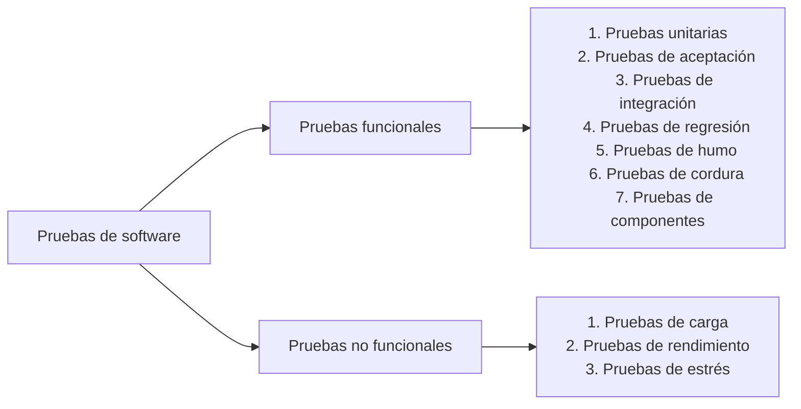
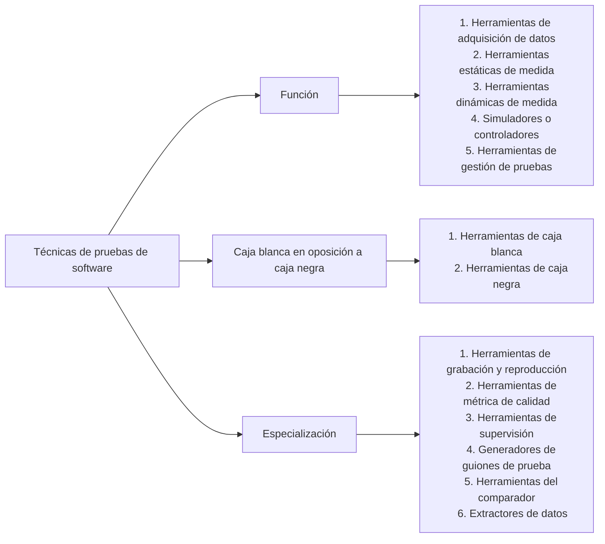
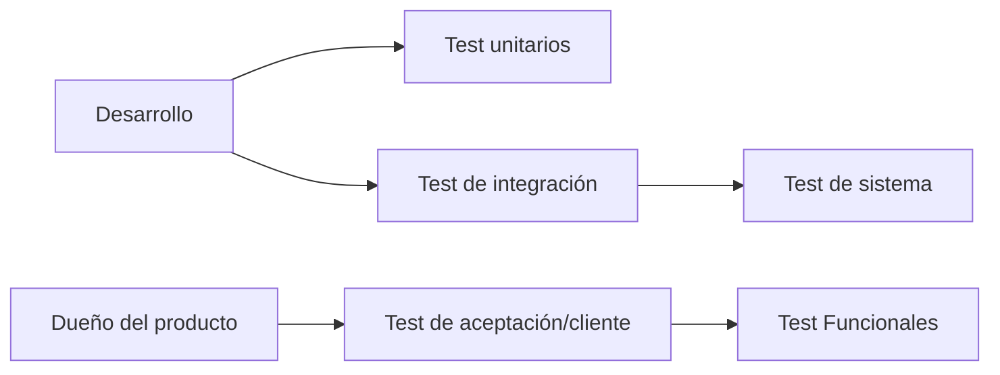

# Resumen de Testing

## Test Automáticos
Cuando se habla de programas grandes y complejos el testing manual se torna complicado y lleva bastante tiempo y es por ello que es conveniente utilizar los test automáticos para agilizar el proceso.

En simples palabras los test automáticos son programas que ponen a prueba nuestro programa.

El uso de este tipo de test brinda al equipo una serie de ventajas:
- Menos pereza para lanzarla con frecuencia
- Es automático
- Rápido feedback
- Mas información en poco tiempo

### Arquitecturas de pruebas automatizadas
Existen **frameworks** de prueba o **stacks** que nos brindan una arquitectura que puede facilitar o no la extensión. Ofrecen una perspectiva dominante para el software de la automatización de pruebas que habilita la ejecución del sistema necesario respecto a ciertos aspectos claves: mantenimiento, capacidad de ampliación, fiabilidad, **concurrencia**, **distribución**, **seguridad** y **recuperación**.

#### Tipos de prueba de software
Evalúan el funcionamiento del programa.

##### Pruebas funcionales

- **Pruebas unitarias:** Aseguran cada célula del código desarrollado. Permiten, en caso de una falla, verificar que componente esta fallando exactamente
- **Pruebas de aceptación:** Forma parte del ultimo proceso de testing y es hecho por personas reales para verificar que se cumplan las tareas requeridas en un ambiente "real".
- **Pruebas de integración:** Estas pruebas se realizan después de las pruebas de componentes y se centran en evaluar cómo interactúan y se comunican las unidades o componentes en un contexto más amplio.
- **Pruebas de regresión:** Se realizan para verificar que las nuevas implementaciones no hayan alterado ni eliminado las funcionalidades existentes.
- **Pruebas de humo:** Se realizan para verificar si las partes mas significativas de la aplicación funcionan o no.
- **Pruebas de cordura:** Son pruebas que se hacen ante implementaciones o correcciones menores para verificar que se hayan solucionado los problemas presentados. Usualmente son sub-pruebas de la de "regresión". 
- **Pruebas de componentes:** Se centra en probar un conjunto de unidades o módulos que trabajan juntos como una unidad funcional más grande.

##### Pruebas no funcionales
Permiten reconocer las vulnerabilidades del producto como el mal desempeño o el bajo rendimiento en determinadas areas del mismo.

- **Pruebas de carga:** Evalúa la respuesta del sistema al ser sometido a una determinada carga.
- **Pruebas de rendimiento:** Evalúa el tiempo de respuesta del sistema al ser sometido a una determinada carga.
- **Pruebas de estrés:** Se centra en determinar el punto máximo que el sistema puede soportar al ser sometido a distintas cargas.

#### Técnicas de pruebas de software

- **Función:** Las herramientas de prueba se pueden categorizar según las funciones que realicen. 
  - **Herramientas de adquisición de datos** Que adquieren datos para utilizar en las tareas de prueba. Los datos se pueden adquirir mediante la conversión. la extracción, la trasformación o la captura de datos existentes, o mediante la generación de guiones de uso o especificaciones suplementarias.
  - **Herramientas estáticas de medida** que analizan información contenida en los modelos de diseño, el código fuente y otros orígenes fijos. El análisis produce información en el flujo lógico, el flujo de datos o la métrica de calidad, como la complejidad, el mantenimiento olas líneas de código.
  - **Herramientas dinámicas de medida** que realizan un análisis durante la ejecución del código. Las medidas incluyen la operación de tiempo de ejecución de código, como la memoria, la detección de errores y el rendimiento.
  - **Simuladores o controladores** que realizan tareas que, por cuestiones de tiempo, gastos o seguridad no están disponibles para las pruebas.
  - **Herramientas de gestión de pruebas** que ayudan en la planificación, el diseño, la implementación, la ejecución, la evaluación y la gestión de tareas de prueba o productos de trabajo.
:::note
Dentro del contexto de las técnicas de pruebas de software, los **"guiones"** generalmente se refieren a conjuntos de instrucciones o pasos predefinidos que se utilizan para realizar pruebas automatizadas en un software
:::
- **Caja blanca en oposición a caja negra:** Suelen caracterizarse como cajas blancas o cajas negras en función de de como se utilicen, o la tecnología y los conocimientos necesarios para utilizarlas.
  - **Herramientas de caja blanca:** dependen del conocimiento del código, los modelos de diseño y otro material de origen para implementar y ejecutar las pruebas.
  - **Herramientas de caja negra:** dependen de los guiones de uso o la descripción funcional del destino de la prueba.
- **Especialización:**
  - **Herramientas de grabación y reproducción:** Los datos de prueba se adquieren durante la grabación de sucesos. Mas tarde, durante la ejecución de la prueba, los datos se utilizan para reproducir el script de prueba, que se utiliza para evaluar la ejecución.
  - **Herramientas de métrica de calidad:** Son herramientas de medida estática que realizan un análisis estático de los modelos de diseño o código fuente para establecer un conjunto de parámetros que describen la calidad del destino de la prueba.
  - **Herramientas de supervisión del cobertura:** Indican la completitud de la prueba mediante la identificación de la cantidad de destino de la prueba cubierta, en alguna dimensión, durante la prueba. Las clases típicas de cobertura son guiones de uso, nodo, ramificación lógica, estado de los datos y puntos de función
  - **Generadores de guiones de prueba:** automatizan la generación de los datos de prueba.
  - **Herramientas del comparador:** comparan los resultados de la prueba con los resultados de referencia e identifican las diferencias.
  - **Extractores de datos:** Proporcionan entradas para los guiones de prueba de orígenes existentes, incluidos bases de datos, secuencias de datos de un sistema de comunicación, informes o modelos de diseño y código de fuente.

### Beneficios del testing
- Rapidez
- Versatilidad
- Simplificación
- Asertividad
- Flexibilidad
- Análisis
- Mayor capacidad de ejecución de pruebas
- Integración continua y DevOps
- Pruebas repetibles

### Ejemplos prácticos de herramientas para automatizar el testing
- **Review Board:** Una herramienta de revisión de código que facilita la colaboración y la revisión de cambios en el código fuente de proyectos de software.
- **Crucible:** Una aplicación de revisión de código desarrollada por Atlassian, diseñada para equipos que utilizan Jira y Bitbucket para el seguimiento y la gestión del código.
- **GitHub:** Una plataforma de desarrollo colaborativo que incluye herramientas para el control de versiones y la revisión de código, ampliamente utilizada por desarrolladores y equipos de software.
- **Phabricator:** Una suite de herramientas de desarrollo de software que incluye revisión de código, seguimiento de tareas, repositorios de código y más, desarrollada por Facebook.
- **Collaborator:** Una herramienta de revisión de código que ayuda a los equipos a revisar y aprobar cambios en el código de manera eficiente.
- **CodeScene:** Una plataforma de análisis de código que proporciona información sobre la salud y la calidad del código, así como recomendaciones para mejorarlo.
- **Visual expert:** Una herramienta que ayuda a analizar y mantener código en lenguajes de programación como Visual Basic y SQL.
- **Gerrit:** Una plataforma de revisión de código que se integra con Git y proporciona un entorno colaborativo para revisar y aprobar cambios en el código.
- **Rhodecode:** Un sistema de gestión de repositorios de código fuente que ofrece control de acceso y revisiones de código integradas.
- **Veracode:** Una herramienta de seguridad de aplicaciones que escanea y evalúa el código en busca de vulnerabilidades y problemas de seguridad.
- **Reviewable:** Una plataforma de revisión de código diseñada para equipos que utilizan GitHub, que mejora el proceso de revisión y colaboración.
- **Peer Review for Trac:** Un complemento para el sistema de seguimiento de problemas Trac que agrega funcionalidad de revisión de código y colaboración a proyectos.

## Pruebas unitarias
En programación, una prueba unitaria es una forma de comprobar el correcto funcionamiento de una unidad de código.

#### Características
Para que una prueba unitaria posea la "calidad suficiente" debe ser:
- Automatizable
- Completa
- Repetible
- Independiente
- Profesional

#### Ventajas
1. Proporciona un trabajo ágil.
2. Calidad del código.
3. Detectar errores.
4. Facilita los cambios y favorece la integración.
5. Proporciona información.
6. Proporciona debugging.
7. El diseño.
8. Reduce el coste.

#### Las tres "A"
Cada caso de prueba debe implementar las siguientes tres "A" para que se puedan ejecutar con éxito.

1. **Arrange (organiza):** Organiza tu prueba para que se pueda comenzar con las pruebas ya sea creando los parámetros u objectos mock para tu método o función

:::note
Los **Mocks** son objetos ficticios que facilitan las pruebas
:::

1. **Act (Actúa):** Realiza la llamada a tu método o función
2. **Assert (Confirmar):** Corrobora que el método o función probado se comporte de la manera esperada.

#### Limitaciones

Las pruebas unitarias no descubrirán todos los errores del código como, por ejemplo, de integración, problemas de rendimiento y todo aquello que afecte al sistema en conjunto. Son efectivas se se utilizan en conjunto con otras pruebas de software.

### Diseño del test unitario

:::info
Los test que pertenecen al **dueño del producto** se llaman test de cliente o de aceptación. Sin embargo, se prefiere decir **"Test de Cliente"**.
:::

:::note
**TDD** significa **Test-Driven Development** y consiste en escribir el código de producción antes de escribir las pruebas unitarias. El objetivo es verificar que el código funciona y es óptimo. Las pruebas unitarias son más centradas en el desarrollador y su lenguaje es ejecutable
:::

:::note
**ATTD** significa **Acceptance Testing Driven Development** o Desarrollo Impulsado por Pruebas de Aceptación y consiste en escribir las pruebas de aceptación antes del código de producción. El objetivo es verificar que el código no solo sea válido, sino que sea la opción más apropiada para solventar el problema. Las pruebas de aceptación son más centradas en el usuario y su lenguaje es convencional
:::

### ¿Qué elementos prueba un test unitario?
Las pruebas unitarias aíslan una parte del código y comprueban que funciona correctamente. El **unit test** suele realizarse durante la fase de desarrollo de aplicaciones de software.

Las características de los test unitarios se agrupan bajo las siglas **FIRST**
- **Fast (Rápido)**
- **Independent (Independiente):** No puede depender de otros para producir resultados satisfactorios.
- **Repeatable (Repetible)**
- **Small (Atómico):** Prueba la minima cantidad de funcionalidad posible.
- **Transparent (Inocuo):** No altera el estado del sistema

### Framework de test unitario
Un **framework** de pruebas unitarias se define como una herramienta que permite escribir pruebas sobre un bloque de código.

Existen muchas herramientas en el mercado para realizar **mock** de clases y métodos:
#### PHPUnit
Es un marco de pruebas unitarias para PHP que también proporciona funcionalidad para crear objetos simulados o "mocks". Los mocks en PHPUnit permiten simular el comportamiento de clases y métodos reales para facilitar la escritura de pruebas unitarias efectivas.

| Ventajas | Desventajas |
| -------- | ----------- |
| + No necesita ninguna librería externa ya que viene incluida en PHPUnit | - Sintaxis engorrosa
| + Extensa y detallada documentación | - No cubre todas las funcionalidades necesarias |

#### Mockery
Es un marco de pruebas unitarias para PHP que también proporciona funcionalidad para crear objetos simulados o "mocks". Los mocks en PHPUnit permiten simular el comportamiento de clases y métodos reales para facilitar la escritura de pruebas unitarias efectivas.

| Ventajas | Desventajas |
| -------- | ----------- |
| + Sintaxis simple | - Una librería más aparte del framework de prueba unitaria |
| + Muchas funcionalidades implementadas de forma muy sencilla | - No cubre todas las funcionalidades necesarias |
| + Extensa y detallada documentación |

#### AspectMock
Es una biblioteca para PHP que permite crear mocks y simulaciones de clases y métodos. Lo que lo hace único es su capacidad para interceptar llamadas a funciones y métodos globales, lo que puede ser útil en situaciones donde otros métodos de mock no pueden utilizarse fácilmente.

| Ventajas | Desventajas |
| -------- | ----------- |
| + Sintaxis simple | - Una librería más aparte del framework de prueba unitaria |
| + Cubre todas las funcionalidades necesarias | - La documentación es muy básica |
